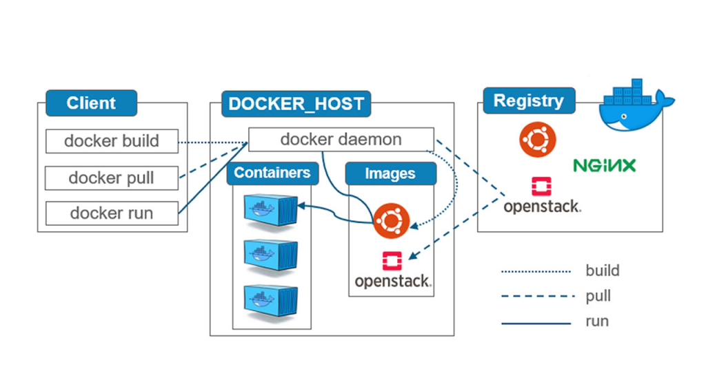

# Docker

## 资源

[【狂神说Java】Docker最新超详细版教程通俗易懂](https://www.bilibili.com/video/BV1og4y1q7M4/?spm_id_from=333.1387.upload.video_card.click&vd_source=c1b032615249e371a441348715da69ba)

## 概述

核心思想:隔离机制

容器化技术:Docker(更快速的交付和部署;更便捷的升级和扩缩容;更简单的系统运维;更高效的计算资源利用)(内核级别的虚拟化)

开源:开放源代码

[Docker官方](https://www.docker.com/)

[Docker文档](https://docs.docker.com/build-cloud/)

[Docker仓库](https://www.docker.com/products/docker-hub/)

### 关键词

镜像(image):模板;镜像创建容器;最终服务运行或者项目运行就是容器中

容器(container):简易的Linux系统;启动,停止,删除,基本命令

仓库(repository):仓库就是存放镜像的地方;Docker Hub;阿里云....都有容器服务器(配置镜像加速)