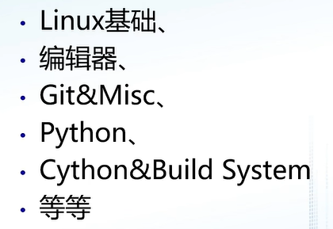
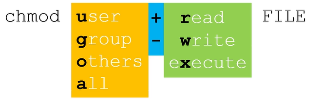

# GAMES_WEBINAR（1）

# 前言

科研是什么?

自我训练的方式|职业|生活方式

> 你如何看待科研？

##  科研

#### 科研方法

科研心理与人生|科研责任与道德|论文阅读与写作|科研**交流**与报告

#### 科研工具

MIT:The missing semester of your cs education

#### 科研导师

科研导师|实践学习

> 随时随地的交流

#### 科研文化

https://121clicks.com/design/east-meets-west-cultural-differences-yang-liu

#### 榜样的力量

同伴——>跟优秀的人学习

# Linux+shell

### LINUX

开源

基于Linux内核:

​						shell:壳：与内核打交道

类Unix：不同但是类似

操作系统集合

优点：开源（生态环境比较好）、功能齐全、快而稳定、包管理....

应用：使用远程服务器（linux）、一些仿真环境（机器人、物理）、OS、网络、软开等

图形学：windows较多一点

如何访问Linux？

1.安装linux系统：乌班图18.04   20.04等等  ；需要一个U盘  |参见知乎

2.使用WSL： 官方文档

3.使用虚拟机：VMware、Virtual Box+镜像|一般与本机的内容不共享|通过网络传输文件|但是比较完善

### shell

> 推荐用2？？？

- echo -将参数输入到界面上

> 指令+参数

echo：输出到屏幕

用空格结束|分隔

第一行：不同的参数，echo按顺序输出

第二行：\转义符：整体一个参数

第三|四行，空格变成字符串的一部分

加粗—常用；可能系统不自带

shell的工作原理：调用程序

命令行的第一个词是程序名称，随后都是参数

词之间用空格分隔

敲下回车之后会开启一个**子进程**跑进相应的程序

>  ics  调用其他程序的程序

底层调用的原理：path

$+变量——>调用变量

### linux下的路径是什么？

绝对路径"/"——根目录

相对路径“./” 从当前目录出发  显示在用户名之后，也可以用pwd指令查看；./可以省略|千万不要‘/'开头 

> pwd 查看当前路径
>
> cd切换当前路径

父路径：返回上一级；向上

-：后退

~：用户文件所在路径

网络套接字

> cat 查看文件内容并输出文件内容

### 文件重定向&管道

< >后跟文件名

\>清空重开

\>>保留原来内容

> grep 查找字符串并标记；如果没有，啥也不输出

### 权限

组：用户所在的组

> r:read
>
> w:write
>
> x:运行execute

chmod（change mod)改变权限位

1.逐位修改

> root 的权限更高，需要加sudo

2.采用八进制位

三位形成一个八进制数

> 规则是什么？

用户权限：

最高权限：root

+sudo（superdo）：以root的身份使用

> sudo echo something >blank.txt
>
> | sudo只能管理到sth，无法管理>

>
>
>tee代表接受标准输入，并输出

### 包管理

> instorm
>
> dpkg  解压并安装

> 名称是难点，不好调研的部分——官方软件包

 

北大源

### 变量

> 不能加空格|加空格，空格和bar会被认为是参数

变量名=   的格式

> set 是环境变量和shell变量的并集

shell的变量是临时变量，环境变量；赋值仅仅添加到shell变量

> ls -a隐藏文件
>
> 不退出，重启.bashrc

### 命令替换&进程替换

比较两个命令的差别

diff进行文件的差别

输入一个文件名；非一个文件；

### shell脚本

边执行，边运行

预编译：c，cpp

系统将会解析成脚本语言，引导解释器，但是不会被执行

> 使用chmod，改变权限

> 编辑：code  vim（终端） nannou、emix（快捷键）

一行行追加，很麻烦