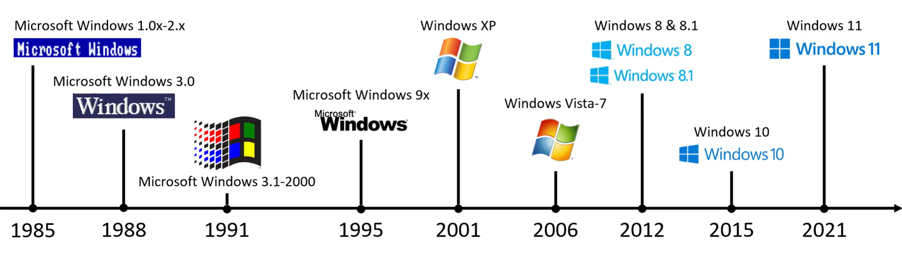
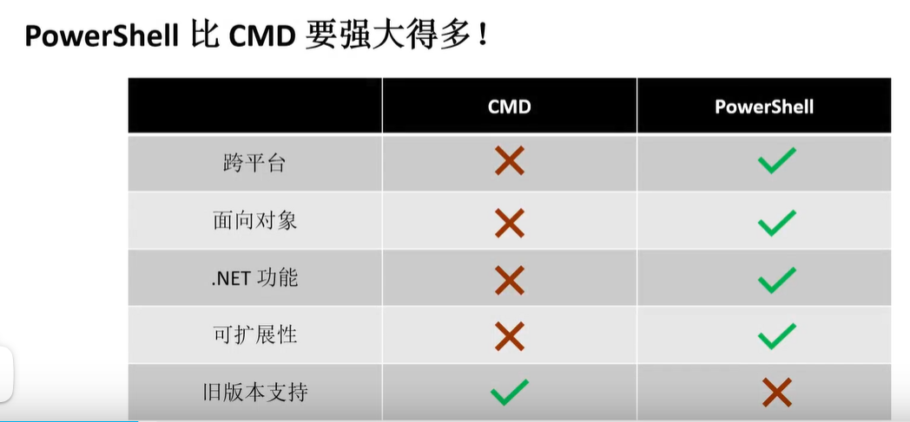
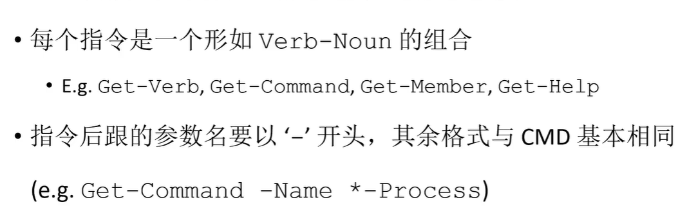

# GAMES_WEBINAR（2）

# windows+cmd+powershell

## windows

微软

图形化操作系统家族

[Microsoft Windows | Microsoft Wiki | Fandom](https://microsoft.fandom.com/wiki/Microsoft_Windows)

[Microsoft Windows - BetaWiki](https://betawiki.net/wiki/Microsoft_Windows)

### 为何使用windows

强大的图形化界面

用户基数大

简单

硬件兼容

....

几乎任何场景都可以应用

### 如何访问windows

> windows:其实是需要购买的
>
> 不确定来源的程序放到虚拟机中运行，可以保护原来的系统

### CMD!=PowerShell

PowerShell不直接执行CMD命令，而是通过别名alias实现

[(4 封私信 / 80 条消息) PowerShell 与 cmd 有什么不同？ - 知乎](https://www.zhihu.com/question/22611859)

> 面向对象的编程语言

> cmd支持字符串，不支持对象
>
> 

## 启动CMD

> 

> 安装或者更新powershell：参考官网教程

> CMD指令
>
> 格式类似Linux Shell
>
> 
>
> > 建议都用‘\’
> >
> > Linux有统一的根目录；Windows里有盘符
> >
> > 选项类似开关
> >
> > /f强制执行
> >
> > ersae删除
>
> 空格和引号的含义不规律
>
> > cmd下无法直接切换盘符,需要再次输入一下盘符
> >
> > 
> >
> > 设计路径|空格可以用“”括起来
> >
> > echo是原样输出“”
> >
> > 重定向和管道与Linux一样

### 账户权限

> 
>
> 来宾账户：锁机但是又想访问
>
> 
>
> > 确认  无攻击

### 文件权限

> 提到了文件的权限的分类？？
>
> 

### CMD变量

set指令仅影响当前窗口，类似与临时变量

> 区分用户和系统

> 尽可能图形化的界面的来解决问题

### CMD脚本

> Linux是用权限位
>
> Windows是用拓展名或者后缀
>
> > @echo off关掉指令提示
> >
> > echo.  什么都不输出
> >
> > echo.> xxx.txt  创建一个文件
> >
> > 
> >
> > 不推荐学
> >
> > 形成python脚本
>
> 
>
> 或者是del

## PowerShell指令

指令更复杂，又称cmdlets

> \* **通配符**
>
> 可能还支持**正则语言**
>
> 指令似乎不区分大小写

### 对象

### PowerShell别名机制

### PowerShell脚本

> -le   小于等于

> 参考官方文档
>
> 不建议学习

> 第4题设计脚本语言