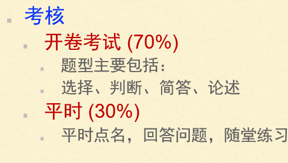
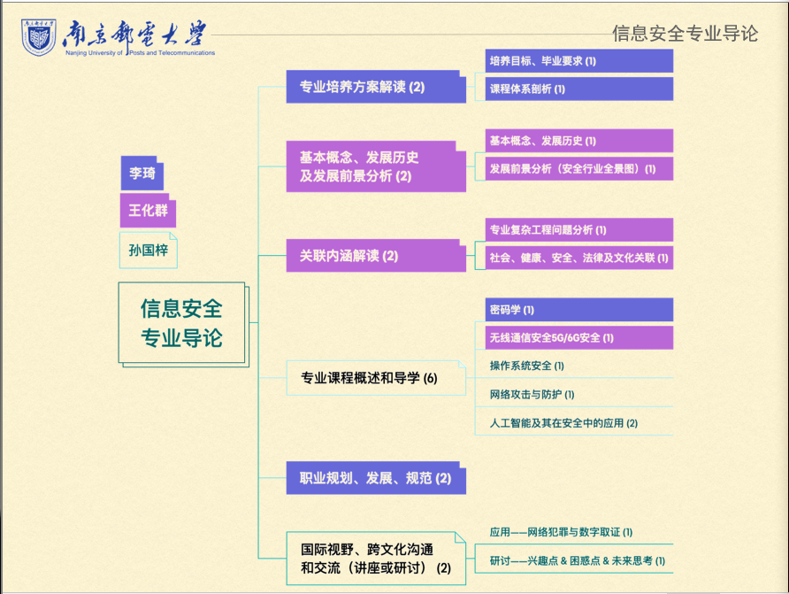
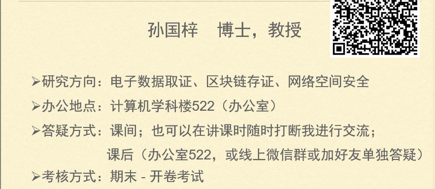
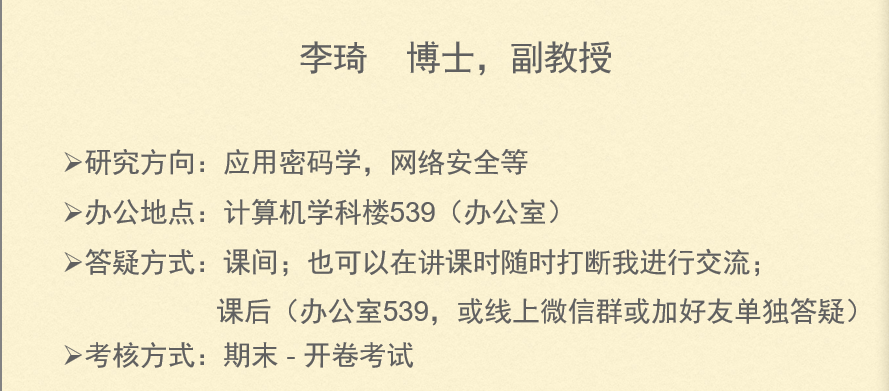
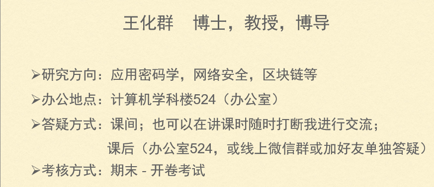

# 信息安全导论

> 简答和论述；开卷可以带任何纸质材料

## 任课老师

###### 黄海平教授

## 琐碎知识点

### .apk

.apk——>AndroidPackage|Android系统安装包

本质上是一个**压缩文件**，类似于或者说就是**zip格式**

>  APK的后缀名改成ZIP，发现其实是可以打开的

res文件夹，是用来存放资源文件的

drawable-hdpi等，是存放图片的；layout文件夹是存放布局的，menu是存放菜单的

AndroidManifest.xml是清单文件，每一个安卓的工程都会有。里面会记录android的一些版本号、使用的SDK版本、图标等信息。但打包后，会编译成二进制的xml文件，打开可能看不到太多的信息。

assets文件夹__里面也会记录一些资源文件。但一般用来记录较大型的资源文件。比如音乐文件、视频文件，或者一些文档、图片等。

classes.dex。因为android现在使用DVM，将.java编译成.class，再编译成.dex，最后打包为.apk.是android平台的可执行文件的类型。

resources.arsc编译后的二进制资源文件。定义了各个资源ID常量，供在代码中索引资源。

META-INF文件夹。这个文件夹简单说下吧。如果我们没有对APK签名，那么其包里是没有这个文件夹的，如果签名才有。android中，没有签名的APK是不允许安装在android设备中的。

### ipa

IPA是Apple程序应用文件iPhoneApplication的缩写。简单来说，Mac 下的软件就像是 Windows 下的[绿色软件]一样，解压后即可使用，不需要安装，卸载的话也只用删除程序文件即可（这里不涉及 pkg格式安装包)

> pkg文件也就是[安装包](https://baike.baidu.com/item/安装包/7693150?fromModule=lemma_inlink)配置文件，是制作[Symbian OS](https://baike.baidu.com/item/Symbian OS/952609?fromModule=lemma_inlink)[安装程序](https://baike.baidu.com/item/安装程序/3765365?fromModule=lemma_inlink)的核心部分
>
> Symbian OS:塞班操作系统

### exe

EXE File英文全名executable file ，译作可执行文件，可移植可执行 (PE) 文件格式的文件，它可以加载到内存中，并由操作系统加载程序执行，是可在操作系统存储空间中浮动定位的可执行程序。

### 应用程序的后缀格式因操作系统和应用程序类型而异。以下是一些常见的应用程序后缀格式：

1.EXE：这是Windows操作系统上的可执行文件格式，用于安装和运行应用程序。
2.APP：这是Mac操作系统上的应用程序格式，用于安装和运行应用程序。
3.APK：这是Android操作系统上的应用程序安装包格式，用于安装和运行应用程序。
4.IPA：这是iOS操作系统上的应用程序安装包格式，用于安装和运行应用程序。
5.DLL：这是Windows操作系统上的动态链接库文件格式，用于共享代码和资源。
6.LIB：这是许多操作系统上的静态链接库文件格式，用于共享代码和资源。
7.BIN：这是一种二进制文件格式，可以包含可执行代码、数据等，常用于嵌入式系统和移动设备。
8.TAR：这是一种压缩文件格式，常用于打包和分发软件和数据。

### 常见的电脑操作系统

## DOS

## macOS

**特点概述：**

苹果开发 运行于**Macintosh**系列电脑上的操作系统

首个在商用领域成功的**图形用户界面**操作系统。
基于**XNU混合内核**的图形化操作系统，一般情况下在普通PC上无法安装的操作系统，但网上也有在PC上运行的macOS（Hackintosh）。

[思考：XNU混合内核是什么？]

> 疯狂肆虐的电脑病毒几乎都是针对Windows的，由于macOS的架构与Windows不同，所以很少受到电脑病毒的袭击。

[两个操作系统的架构不同体现在哪里]

**两个主要版本:**

##### Class Mac OS

老旧且已不被支持的“Classic” Mac OS（系统搭载在1984年销售的首部Mac与其后代上，终极版本是[Mac OS 9]。采用Mach作为[内核]，在MacOS 7.6以前用“System x.xx”来称呼

特点：

完全没有命令行模式

几乎没有内存管理、协同式[多任务]（cooperative multitasking）和对扩展冲突敏感

新形的[文件系统]：分别把参数存在“资源分支”（resource fork），而把[原始数据]存在“数据分支”（data fork）；无法和其他操作系统沟通

Mac OS 9使用[B+树]结构的文件系统进行[文件管理]

#### 新版Mac OS

新的Mac OS X结合[BSD](https://baike.baidu.com/item/BSD/3794498?fromModule=lemma_inlink) Unix、[OpenStep](https://baike.baidu.com/item/OpenStep/10161992?fromModule=lemma_inlink)和Mac OS 9的元素。它的最底层建基于Unix基础，其代码被称为[Darwin](https://baike.baidu.com/item/Darwin/2537108?fromModule=lemma_inlink)，实行的是部分[开放源代码](https://baike.baidu.com/item/开放源代码/114160?fromModule=lemma_inlink)。

[BSD unix、OpenStep Mac OS 9是什么]

[Unix基础是什么？]

> XNU混合内核是什么？

# 未来学习中不断深究为什么？