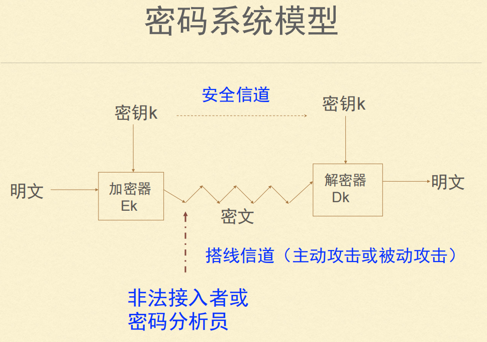

# 密码学

> # 课后作业
>
> 1. 了解密码法的产生以及相关的基本内容
>2. 密码学主要分为密码编码学以及密码分析学，区别和联系
> 3. 密码学的基本概念了解：明文、密文、加密、解密、算法、密钥、密钥空间等
>4. 理解对称加密算法的基本原理、优缺点、常用算法
> 5. 理解非对称加密算法的基本原理、优缺点、常用算法
>6. 实例化理解非对称加密算法在数据加解密、签名方面的具体应用
> 7. 理解哈希算法的基本原理、优缺点、常用算法、应用场景

### 密码与密码法

>1. 密码，是指采用特定变换的方法对信息等进行加密保护、安全认证的技术、产品和服务
>2. 密码不是账号的密码（口令）
>3. 密码的分类：核心密码、普通密码、商用密码

### 密码学概述

> 密码学：一门古老而又年轻的学科
>
> 密码学的真正起点：Claude.E.Shannon发表《保密系统的通信理论》
>
> 密码学的目的：隐藏信息的含义而非信息的存在
>
> > 密码学是信息安全的核心
>
> > 信息安全的实现：技术(密码学等) 管理(立法)
>
> > ### 密码学的发展：
> >
> > * 古典密码学（古代——1949年）
> >
> >   隐写术、黑帮行话
> >
> >   电报通信建立起来后，采用复杂的机械和电动机设备实现
> >
> > * 近代密码学（1949年——1976年）
> >
> >   1949年 Shannon 的《保密系统的通信理论》
> >
> >   早期对称密码学
> >
> > * 现代密码学（1976年之后）
> >
> >   1976年 Diffie和Hellman的《密码学的新方向》
> >
> >   1977年 美国 DES   DES（数据加密标准，Data Encryption Standard）是一种对称密钥加密算法
> >
> >   2000年 美国 AES  AEC（Advanced Encryption Standard，高级加密标准）是一种对称密钥加密算法
>
> > ### 密码学的基本概念
> >
> > 密码学
> >
> > 密码编码学——制作
> >
> > 密码分析学——破解
> >
> > > 明文（Plaintext）
> > >
> > > 需要变换的原消息——人们能够读懂的信息
> > >
> > > 密文（Ciphertext）
> > >
> > > 明文经过变换成为另一种隐蔽的形式——人们难以理解的信息
> > >
> > > 加密（Encryption）
> > >
> > > 完成变换的过程——将明文变换成密文的过程
> > >
> > > 解密（Decryption）
> > >
> > > 从密文中恢复出明文——密文还原成原来的明文的过程
> > >
> > > 算法（Algorithm）
> > >
> > > 数学方法、数学函数——用于加密和解密的数学函数
> > >
> > > 密钥（Key）——一串适当长度的字符串或数字串，可以控制加密和解密
> > >
> > > 的过程
> > >
> > > 加密密钥（Encryption Key）
> > >
> > > 解密密钥（Decryption Key）
> > >
> > > 密钥空间——密钥的取值范围
>
> > #### 密码学的假设
> >
> > >Kerckhoffs Principle (柯克霍夫原则)：加密算法不是保密的
> > >
> > >解释：只有密钥是敌方所不知道的
> >
> > 为什么这样假设?
> >
> > 过去的经验表明一但加密算法被破解，一切全完了
> >
> > 加密算法无法保证敌方永远不知道
> >
> > 最好提前知道加密方法中的不足
>
> > #### 密码体制的分类
> >
> > > 密钥管理：密钥的产生 分配 保管 销毁 
> > >
> > > 加密处理 加密解密
> >
> > > 私钥（单钥、对称）密码体制
> > >
> > > 公钥（双钥、非对称）密码体制
>
> 
>
> > #### 补充知识点
> >
> > * DEC
> >   1. **对称加密**：DES使用相同的密钥进行加密和解密，这意味着发送方和接收方必须安全地共享密钥。
> >   2. **密钥长度**：DES使用56位的密钥来加密数据，但实际上，由于密钥的生成方式，密钥长度为64位，其中每第8位是奇偶校验位，实际有效密钥长度为56位。
> >   3. **块加密**：DES是一种块加密算法，将数据分成64位的块进行处理。每个块会经过多轮的加密过程，DES采用16轮的处理。
> > * AEC
> >   1. **对称加密**：AES使用相同的密钥进行加密和解密，密钥的保密性对安全性至关重要。
> >   2. **密钥长度**：AES支持三种密钥长度：128位、192位和256位。这意味着同样的数据可以使用不同长度的密钥进行加密，从而提供不同层次的安全性。
> >   3. **块加密**：AES采用分组加密机制，将数据分成128位的块，每个块经过多个处理轮来实现加密。常见的轮数有10轮（128位密钥）、12轮（192位密钥）和14轮（256位密钥）。
> >   4. **安全性**：AES被广泛认为是非常安全的，至今尚未发现针对其的有效攻击方式。其设计考虑了多种攻击模式，包括差分分析和线性分析。
> > * 
> >
> > 

### 古典密码

>> #### 置换密码：按某种规则把字符秩序打乱重排
>>
>> 矩阵+栅栏技术
>>
>> > 形成矩阵
>> >
>> > 初等变换
>
>> #### 代换密码：将明文元素（字符、比特）映射成密文的元素
>>
>> > ##### 简单代码密码
>> >
>> > 特例，移动3位就是凯撒密码（Caesar’s cipher）
>>
>> > ##### 改进后的代换密码：不是简单的移位，而是进行随机的排列
>> >
>> > 存在26！种可能
>>
>> > ##### 何为安全？
>> >
>> > 计算安全：一定时间内的最大算力无法计算
>> >
>> > 实际安全：计算成本>信息本身的价值
>>
>> > ##### 密码分析方法
>> >
>> > 统计学方法：统计字母出现的频率
>
>> #### “一次一密”
>
>> #### 电话本
>>
>> 

