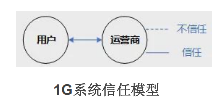
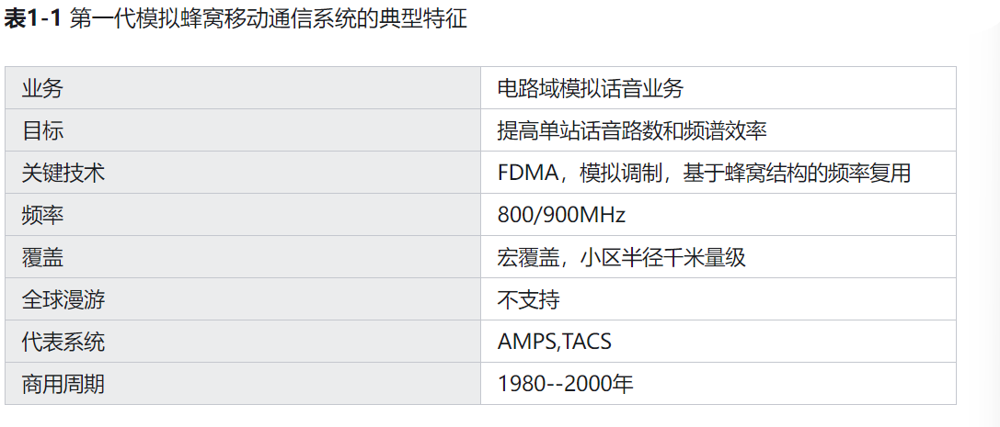
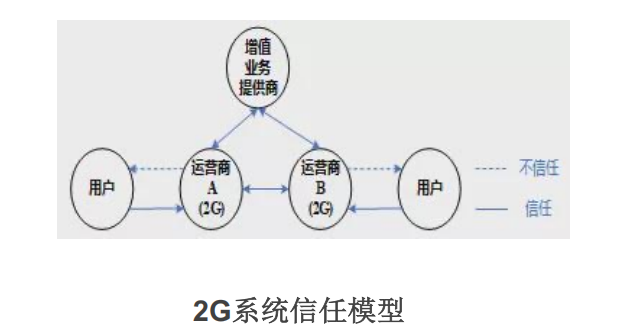

# 无线通信安全5G/6G安全

> # 课后作业
>
> 1、了解移动通信的发展历程
>
> 2、了解移动通信安全的发展历程
>
> 3、学习5G/6G安全威胁和防护方法

## 技术生词

> 1. 蜂窝标准
>
> 2. 信任标准
>
> 3. 窄带数据业务
>
> 4. 网络切片
>
> 5. 垂直行业
>
> 6. 移动宽带
>
> 7. 身份认证
>
> 8. AKA协议(Authentication and Key Agreement，
>
>    认证和密钥协议)
>
> 9. 拜访域
>
> 10. 非3GPP接入 二次认证
>
> 11. 隐藏标识符对SUPI/IMSI
>
> 12. IMSI, SUPI. SUCl
>
> 13. UE终端标识符  
>
> 14. LTE终端标识
>
> 15. 服务网络架构SBA(Servive Based Achitecture)
>
> 16. 太赫兹光波
>
> 17. 6G白皮书《6G泛在无线智能的关键驱动因素及其研究挑战》荷兰
>
> 18. 6G系统安全机制:万物智联，数字孪生;**智慧内生、安全内生、多域融合、算网一体**
>
> 19. 无线网络体系结构分布式和去中心化
>
> 20. 拟态防御架构
>
> 21. 密钥内生
>
> 22. 密钥演进
>
> 23. 无线信道指纹构造的内生安全与传统密码技术融合
>
> 24. 前向安全数字签名体制
>
> 25. PoS（权益证明）
>
> 26. 联盟链
>
> 27. 后向安全数字签名
>
> 28. 密钥安全存储与防护技术
>
> 29. 关键算法自适应组合技术
>
> 30. 基于冷热钱包的密钥安全技术
>
> 31. 适用于6G和区块链的新型国产密码算法
>
> 32. 安全多方计算技术

## 蜂窝网络与蜂窝网络标准下的信任机制

>即移动网络  移动通信硬件架构
>
>> #### 组成:
>>
>> 移动站：终端
>>
>> 基站子系统：移动基站（大铁塔）、无线收发设备、专用网络（一般是[光纤](https://zh.wikipedia.org/wiki/光纤)）、无数的数字设备
>>
>> 网络子系统
>
>> #### 1G(**模拟蜂窝系统**)
>>
>> > #####信任模型：
>> >
>> > 
>>
>> > ##### 典型特征
>> >
>> > 
>
>> #### 2G(**窄带数字蜂窝系统**)
>>
>> > ##### 信任模型：
>> >
>> > 
>>
>> > ##### 主要特征：
>> >
>> > 
>>
>> > ##### 补充说明
>> >
>> > * 欧洲的GSM(采用TDMA技术，20世纪90年代初期商用)系统
>> >
>> > *   北美的IS-95(采用CDMA技术，20世纪90年代中期商用)系统
>> >
>> > * **全球移动通信系统**（**G**lobal **S**ystem for **M**obile Communications）|**泛欧数字式移动电话系统**
>> >
>> > * 分组无线服务(General Packet Radio Service,GPRS)
>> >
>> > * 增强型数据速率GSM演进(EDGE)
>> >
>> > * CDMA的演进版本CDMA1x
>> >
>> > * 
>> >
>> >   维护者：3GPP
>> >
>> >   优势：
>> >
>> >   用户端：引入更加廉价的短消息服务(SMS)
>> >
>> >   网络运营商：允许网络漫游
>> >
>> >   ?基于电路交换的数据业务和传真服务
>> >
>> >   ?[WAP](https://zh.wikipedia.org/wiki/WAP)协议
>> >
>> >   ?[通用分组无线服务](https://zh.wikipedia.org/wiki/通用分组无线服务)（GPRS）
>> >
>> >   ?[EDGE](https://zh.wikipedia.org/wiki/EDGE)技术
>>
>> 

## 6G系统安全机制

> ### 内生安全：邬江兴院士
>
> > #### 定义：
> >
> > 从信息化系统内不断生长出自适应、自主和自成长的安全能力
>
> > #### 目标：
> >
> > 一般性网络攻击：自我发现、自我修复、自我平衡
> >
> > 大型网络攻击：能自动预测、自动告警和应急响应
> >
> > 极端网络灾难：保证关键业务不中断
>
> > #### 要求：
> >
> > 可信增强、智能共识、智能防御和泛在协同
>
> > #### 特征：
> >
> > 主动免疫、虚拟共生、弹性自治、泛在协同
>
> 

### 重要参考文献：

[1G到6G，最全移动通信发展史 - 知乎](https://zhuanlan.zhihu.com/p/671268577)