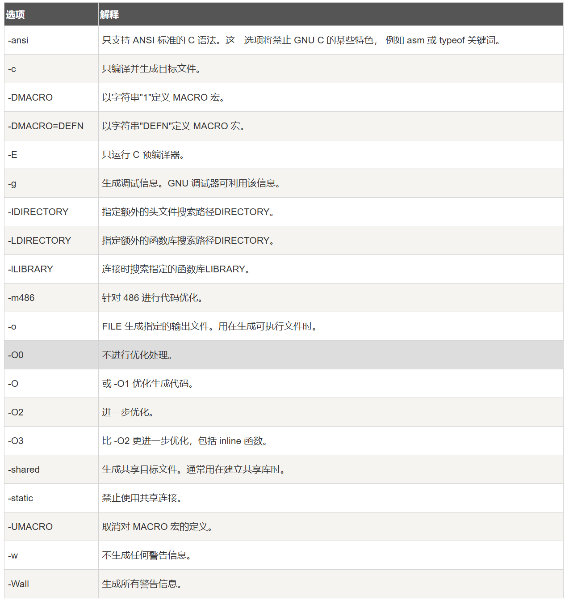

> 各类快捷键和命令
# PowerShell|cmd
## 常见命令
### cd 地址——(change directory)
### dir ——(directory)
### python xxx.py——运行python程序
### python——终端进入python
### quit()——终端中退出python
### mkdir 文件夹——在目标文件夹下创建文件夹
### cd ..——返回父目录
### pytest|python -m pytest-运行pytest

### rm -rf xxx(强制xx文件夹)

### rm xx(删除xx)

## WSL

### 安装:wsl --install --web-download

### 查看其他linux发行版 wsl --list --online

### 下载其他发行版 wsl --install xxx --web-download

### 查看安装的子系统 wsl --list -v

### 切换wsl  wsl --set-default xxx

### 启动子系统 wsl -d xxx

### 退出 exit

### 卸载子系统 wsl --unregister xxx

### 子系统备份  wsl --export xxx xx.tar

### 导入备份 wsl --import xxx  压缩包路径

### 文件共享  df-h

### 命令混用

### wslg 安装: sudo apt-get install gimp;启动 gimp

### 显卡直通: nvidia-smi

### kail桌面 sudo apt install kali-win-kex;kex --esm --ip -sound

### ubuntu桌面 hyper -v

### wsl的高级配置

# Visual Studio

## 快捷键
### 1.加注释:<S+A+s>
### 2.保存文件:<C+S>
## 终端命令
### 1.新建文件或者打开文件:<code 文件名>(当前文件夹下)

# Pycharm

# Vim

# 

###python

### 5.更新任何包:python -m pip install --upgrade package_namea
### 6.安装包:    python -m pip install (--user) package_name
> 运行pip模块:python -m pip
> 更新一个包: install --upgrade 包名
### 7.创建虚拟环境: python -m venv 环境名
### 8.激活.......: ./环境名/Scripts/Activate
### 9.停止.......:  deactivate

# g++

## 编译xx.cpp为指定名字的文件: g++ xx.cpp -lstdc++ -o xx

> 解释: 
>
> 1. -lstdc++   连接c++标准库
> 2. 
> 3. -o:指定可执行文件的文件名

## 运行xx文件: ./xx

## 编译多文件： gcc x1.cpp x2.cpp -o yyy

## 只编译不链接: g++ xx.cpp -c

## 链接所有文件： g++ \*.o -o xx

