# 南京邮电大学MOOC高级程序语言设计（C语言）|完整版

## 声明

笔者本着**开源精神**和为了同学**更好地解决MOOC中的难题**，写下了这篇blog。同时，笔者申明，本片blog仅可用于**参考学习，严禁抄袭**

## 题1：华氏温度和摄氏温度的转化

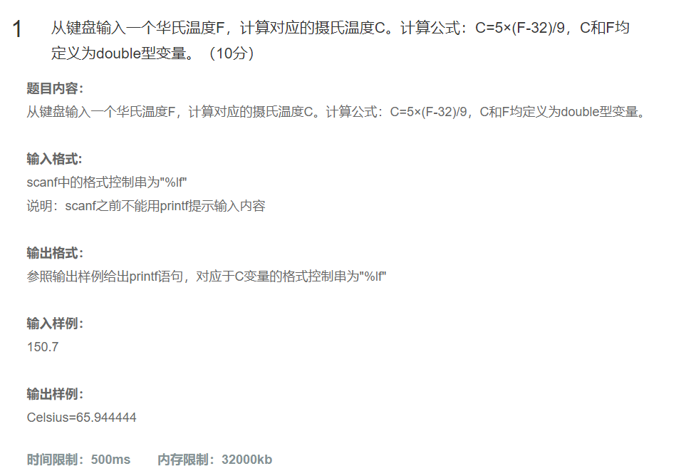

```c
#include<stdio.h>
int main()
{
   double C = 0.0 ,F = 0.0;
   scanf("%lf",&F);
   C=5*(F-32)/9;
  printf("Celsius=%lf",C);
   return 0;
}
```

> ### 算法基本步骤和流程
>
> 1. 定义两个双精度浮点数变量 `C` 和 `F` 分别用于存储摄氏温度和华氏温度，初始时都设为 `0.0`。
> 2. 使用 `scanf` 函数读取用户输入的华氏温度值，并存储在变量 `F` 中。
> 3. 根据摄氏温度与华氏温度之间的转换公式 `C = 5*(F - 32)/9` 计算摄氏温度。
> 4. 使用 `printf` 函数输出计算得到的摄氏温度值，格式化为浮点数输出。
> 5. 程序结束，返回 `0` 表示正常退出。
>
> ### 关键操作或决策点解释
>
> - **温度转换公式**：这里使用的公式是国际上通用的华氏温度转摄氏温度的公式，即 C=59×(F−32)*C*=95×(*F*−32)，其中 F*F* 是华氏温度，C*C* 是摄氏温度。
> - **输入读取**：使用 `scanf` 函数读取用户输入的华氏温度值，需要注意的是，如果用户输入了非数字字符，可能会导致程序行为不符合预期。
> - **输出显示**：使用 `printf` 函数输出结果，这里直接输出了计算后的摄氏温度值，没有做额外的格式控制如保留小数位数等。
>
> ### 注意事项
>
> - 该程序假设用户会正确地输入一个有效的华氏温度数值。实际应用中可能需要添加错误处理机制来确保输入的有效性。
> - 输出的结果直接以浮点数形式给出，若需要更精确的显示（例如限制小数点后几位），可以在 `printf` 的格式字符串中指定精度，比如 `%.2lf` 来限制输出两位小数。

## 题2：求s的值

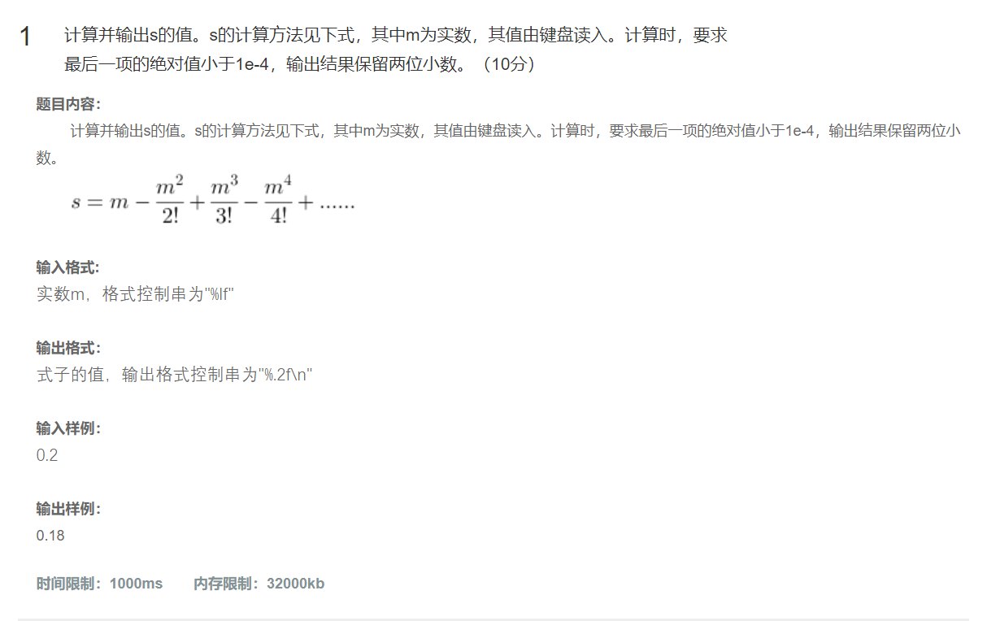

~~~c
#include<stdio.h>
#include<math.h>
int main()
{
	double m = 0, s = 0, sign = 1;
	int i = 1;
	scanf("%lf", &m);
	double item = m;
	while (fabs(item) >= 1e-4)
	{
		item = sign * m / i;
		s += item;
		m *= m;
		i = i * (i + 1);
		sign = -sign;;
	}
	printf("%.2f\n", s);
	return 0;
}
~~~

> ### 算法基本步骤和流程
>
> 1. **初始化变量**：
>    - 定义并初始化双精度浮点数 `m` 和 `s` 为 `0.0`，用于存储输入值和累加结果。
>    - 定义并初始化整型变量 `i` 为 `1`，作为分母的乘积因子。
>    - 定义并初始化双精度浮点数 `sign` 为 `1`，用于控制项的正负交替。
>    - 定义并初始化 `item` 为 `m`，表示当前计算项。
> 2. **读取输入**：使用 `scanf` 函数从标准输入读取用户提供的数值，并将其存入变量 `m` 中。
> 3. **循环计算**：进入 `while` 循环，条件是当前项 `item` 的绝对值大于等于 1×10−41×10−4。在每次循环中：
>    - 计算当前项 `item` 的值为 `sign * m / i`。
>    - 将当前项 `item` 加到累加和 `s` 上。
>    - 更新 `m` 为 `m` 的平方，以准备下一项的计算。
>    - 更新分母 `i` 为 `i * (i + 1)`，这看起来是为了形成一个特定序列的分母。
>    - 反转符号 `sign` 以便于下一项的正负交替。
> 4. **输出结果**：当循环结束时，通过 `printf` 函数打印出累加结果 `s`，格式化为保留两位小数。
> 5. **程序结束**：返回 `0` 表示程序正常结束。
>
> ### 关键操作或决策点解释
>
> - **项的计算**：每一项 `item` 都根据公式 `sign * m / i` 计算，其中 `sign` 控制项的正负交替，`m` 在每次迭代后变为自身的平方，而 `i` 则是一个逐渐增大的分母。
> - **循环终止条件**：`while` 循环基于 `item` 的绝对值是否小于 1×10−41×10−4 来决定是否继续执行。这意味着一旦某一项变得足够小（即对总和的影响可以忽略不计），循环将停止。
> - **符号交替**：`sign = -sign;` 这行代码确保了相邻项之间的符号交替，这是许多数学级数（如泰勒级数）中的常见特性。
> - **分母更新逻辑**：`i = i * (i + 1);` 这个更新规则并不常见，它不是简单的递增而是形成了一个快速增长的分母序列。这种设计可能是为了实现特定的数学级数或算法需求。
>
> ### 注意事项
>
> - **输入验证**：该程序假设用户会输入一个有效的数字。实际应用中应添加输入验证来确保程序的健壮性。
> - **算法正确性**：由于分母 `i` 的更新方式非常特殊，需要仔细检查这个算法是否符合预期的数学公式或级数展开。如果目标是计算某个特定的数学函数（例如指数函数、对数函数等），则应该确认此算法是否正确实现了相应的级数。
> - **性能问题**：对于某些输入值，特别是较大的 `m` 值，可能会导致循环次数过多，影响性能。此外，`m *= m;` 操作会导致 `m` 快速增大，可能导致数值溢出或失去精度。
> - **输出格式**：结果被格式化为保留两位小数输出，这适用于大多数情况，但如果需要更高的精度，可以根据需求调整。

## 题3：以每行8个的形式输出100-999内的质数

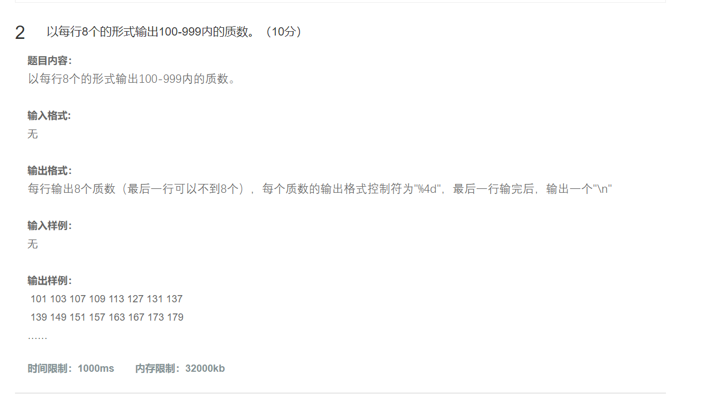

~~~c
#include<stdio.h>
#include<math.h>
int judge(int n)
{
	int k = (int )sqrt(n);
	int i = 0;
	for (i = 2;i <= k; i++)
	{
		if (n % i== 0)
		{
			return 0;
		}
	}
	return 1;
}
int main()
{
	int a = 100;
	int i = 0;
	for (a = 100; a <= 999; a++)
	{
		if (judge(a))
		{
			printf("%4d",a);
			i++;
			if (i % 8 == 0)
			{
				printf("\n");
			}
		}
	}
	return 0;
}
~~~

> ### 算法基本步骤和流程
>
> 1. **定义判断函数 `judge`**：
>
>    - 该函数接收一个整数 `n`，用于判断 `n` 是否为素数。
>    - 计算 `n` 的平方根 `k` 并取整，作为循环的上限。
>    - 使用 `for` 循环从2遍历到 `k`，检查 `n` 是否能被任意一个小于等于 `k` 的整数整除。
>    - 如果找到任何因子，则返回 `0` 表示 `n` 不是素数；如果没有任何因子，则返回 `1` 表示 `n` 是素数。
>
> 2. **主函数 `main`**：
>
>    - 初始化变量 `a` 为100，用作循环中的计数值。
>- 初始化变量 `i` 为0，用于记录已经打印了多少个素数。
>    - 使用 for 循环从100遍历到999。
>   - 对于每个数字 `a`，调用 `judge(a)` 判断其是否为素数。
>       - 如果 `judge(a)` 返回 `1`，则打印该数字，并增加 `i` 的值。
>      - 每当 `i % 8 == 0` 时（即每打印8个素数后），换行以开始新的一行输出。
>       
>3. **程序结束**：所有数字都处理完毕后，程序正常结束。
> 
> ### 关键操作或决策点解释
> 
>- **判断素数**：`judge` 函数通过检查小于等于 `sqrt(n)` 的所有整数来确定 `n` 是否为素数。这是因为如果 `n` 能够被某个大于其平方根的数整除，那么它一定也能被一个小于其平方根的数整除。
>       - **循环控制**：在 `main` 函数中，外层 `for` 循环遍历100到999之间的所有整数，而内部的逻辑确保只有素数才会被打印出来。
>- **换行逻辑**：使用 `i % 8 == 0` 来判断是否应该换行，保证了每行最多打印8个素数。
> 
>    ### 注意事项
> 
> - **边界条件**：当前代码假设100到999之间的数字都是有效的输入范围。对于不同的需求，可能需要调整这个范围。
> - **效率问题**：`judge` 函数在判断较大数字时可能会变得相对缓慢，因为需要进行多次除法运算。不过在这个特定范围内（100到999），性能影响不大。
>- **格式化输出**：使用 `printf("%4d", a);` 确保每个数字占用4个字符宽度，这样可以保持输出整齐美观。同时，每8个素数换行的逻辑也使得输出更加易读。
> - **素数判断优化**：虽然当前的素数判断方法是有效的，但对于更大的范围或者更高的性能要求，可以考虑更高效的算法如埃拉托斯特尼筛法等。

## 题4：打印星号组成的倒置等腰三角形

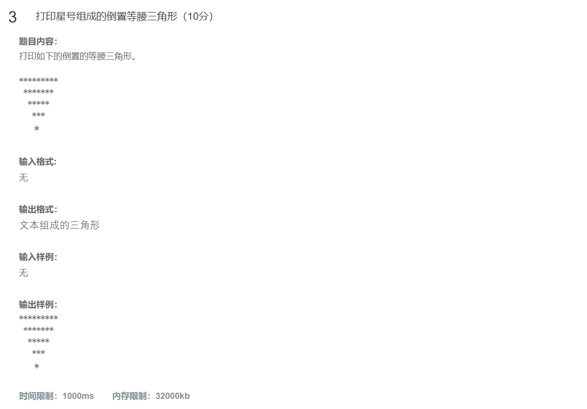

~~~c
#include<stdio.h>
int main()
{
	int i = 0;
	int j = 0;
	for (i = 0; i < 5; i++)
	{
		for (j = 0; j < i; j++)
		{
			printf(" ");
		}
		for (j = 0; j < 9 - 2 * i; j++)
		{
			printf("*");
		}
		printf("\n");
	}
	return 0;
}
~~~

>### 算法基本步骤和流程
>
>1. **初始化变量**：
>   - 定义并初始化两个整型变量 `i` 和 `j` 为 `0`，用于控制外层和内层循环。
>2. **外层循环**：
>   - 使用 `for (i = 0; i < 5; i++)` 控制行数，循环执行5次，每次对应一行输出。
>3. **第一内层循环（打印空格）**：
>   - 对于每一行，使用 `for (j = 0; j < i; j++)` 打印 `i` 个空格，以确保每一行的星号部分逐渐向右移动，形成倒三角的形状。
>4. **第二内层循环（打印星号）**：
>   - 接着使用 `for (j = 0; j < 9 - 2 * i; j++)` 打印星号。这个循环的次数决定了每行中星号的数量，随着 `i` 的增加，星号数量逐渐减少，从而形成倒三角的顶部逐渐变窄的效果。
>5. **换行**：
>   - 每一行的星号打印完毕后，使用 `printf("\n");` 进行换行，准备下一行的输出。
>6. **程序结束**：所有行都打印完毕后，程序正常结束。
>
>### 关键操作或决策点解释
>
>- **空格打印逻辑**：通过 `for (j = 0; j < i; j++)` 循环打印 `i` 个空格，确保星号部分在每一行中逐渐向右移动。随着 `i` 的增加，空格数量也增加，使得图案看起来像是在缩小。
>- **星号打印逻辑**：`for (j = 0; j < 9 - 2 * i; j++)` 循环打印星号，其中 `9 - 2 * i` 决定了每行中星号的数量。这个表达式保证了星号的数量从最开始的9个逐渐减少到1个，形成倒三角形的上半部分。
>- **换行操作**：每次内层循环结束后调用 `printf("\n");` 实现换行，以便下一行能够正确地紧接在当前行下方。
>
>### 注意事项
>
>- **图案尺寸固定**：该代码生成的图案大小是固定的，即5行的倒置等腰三角形。如果需要生成不同大小的图案，可以考虑将行数作为参数传递，并相应调整星号和空格的数量计算方式。
>- **输出格式**：代码直接使用空格和星号来构建图案，这样的输出格式简单明了，但也可以根据需求进行调整，例如使用其他字符代替星号或改变间距等。

> 随意说：我总是觉得这么做有点奇怪，不如直接4个printf()直接打印相关内容，又省事又快速
>
> 可惜不给过，尽管输出一致

## 题5：求圆锥体的体积和表面积

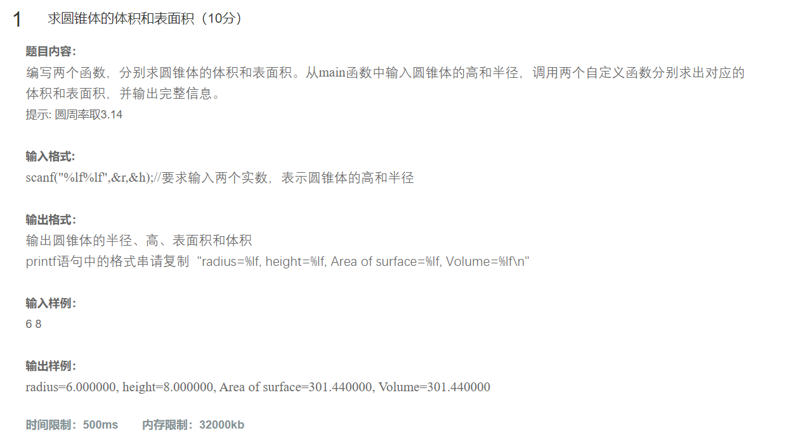

~~~c
#include<stdio.h>
#include<math.h>
#define pi 3.14
double v(double r, double h)
{
	return pi * r * r * h / 3;
}
double s(double r, double h)
{
	return  pi * r * r + pi * r * sqrt(r * r + h * h);
}
int main()
{
	double r = 0, h = 0;
	scanf("%lf%lf", &r, &h);
	printf("radius=%lf, height=%lf, Area of surface=%lf, Volume=%lf\n", r, h, s(r, h), v(r, h));
	return 0;
}


~~~

>### 算法基本步骤和流程
>
>1. **定义常量和函数**：
>   - 使用 `#define pi 3.14` 定义了圆周率的近似值。
>   - 定义了两个函数 `v(double r, double h)` 和 `s(double r, double h)`，分别用于计算圆锥的体积和表面积。
>2. **主函数 `main`**：
>   - 初始化两个双精度浮点数变量 `r` 和 `h` 为 `0`，用于存储用户输入的圆锥半径和高。
>   - 使用 `scanf` 函数从标准输入读取用户提供的圆锥半径 `r` 和高 `h`。
>   - 调用 `s(r, h)` 计算圆锥的表面积，并调用 `v(r, h)` 计算圆锥的体积。
>   - 使用 `printf` 函数打印出圆锥的半径、高、表面积和体积。
>3. **程序结束**：所有计算和输出完成后，程序正常结束。
>
>### 关键操作或决策点解释
>
>- **体积计算函数 `v`**：
>  - 根据圆锥体积公式 V=13πr2h*V*=31*π**r*2*h* 实现。
>  - 返回值为圆锥的体积。
>- **表面积计算函数 `s`**：
>  - 根据圆锥表面积公式 S=πr2+πrl*S*=*π**r*2+*π**r**l*，其中 l=r2+h2*l*=*r*2+*h*2 是斜边（母线）长度。
>  - 返回值为圆锥的表面积，包括底面和侧面。
>- **输入读取**：
>  - 使用 `scanf` 函数读取用户输入的圆锥半径 `r` 和高 `h`。需要注意的是，如果用户输入非数字字符，可能会导致程序行为不符合预期。
>- **输出显示**：
>  - 使用 `printf` 函数格式化输出圆锥的半径、高、表面积和体积。格式字符串确保了每个数值都以浮点数形式展示，并在一行内输出所有信息。
>
>### 注意事项
>
>- **圆周率精度**：使用了宏定义 `#define pi 3.14` 来近似表示圆周率。对于更高精度的需求，可以考虑使用更精确的值如 `3.141592653589793` 或者使用 `<math.h>` 库中的 `M_PI` 常量（如果可用）。
>- **输入验证**：当前代码假设用户会正确地输入两个有效的数字。实际应用中应添加输入验证逻辑，以确保程序的健壮性。
>- **数学运算**：`sqrt` 函数来自 `<math.h>` 库，用于计算平方根。确保在编译时链接了数学库（例如使用 `-lm` 选项）。
>- **输出格式**：结果被直接输出，没有特别限制小数位数。可以根据需求调整 `printf` 的格式化字符串来控制输出的小数位数，例如 `%.2lf` 可以保留两位小数。
>
>这段代码实现了一个简单的圆锥几何属性计算器

## 题6：验证哥德巴赫猜想之一

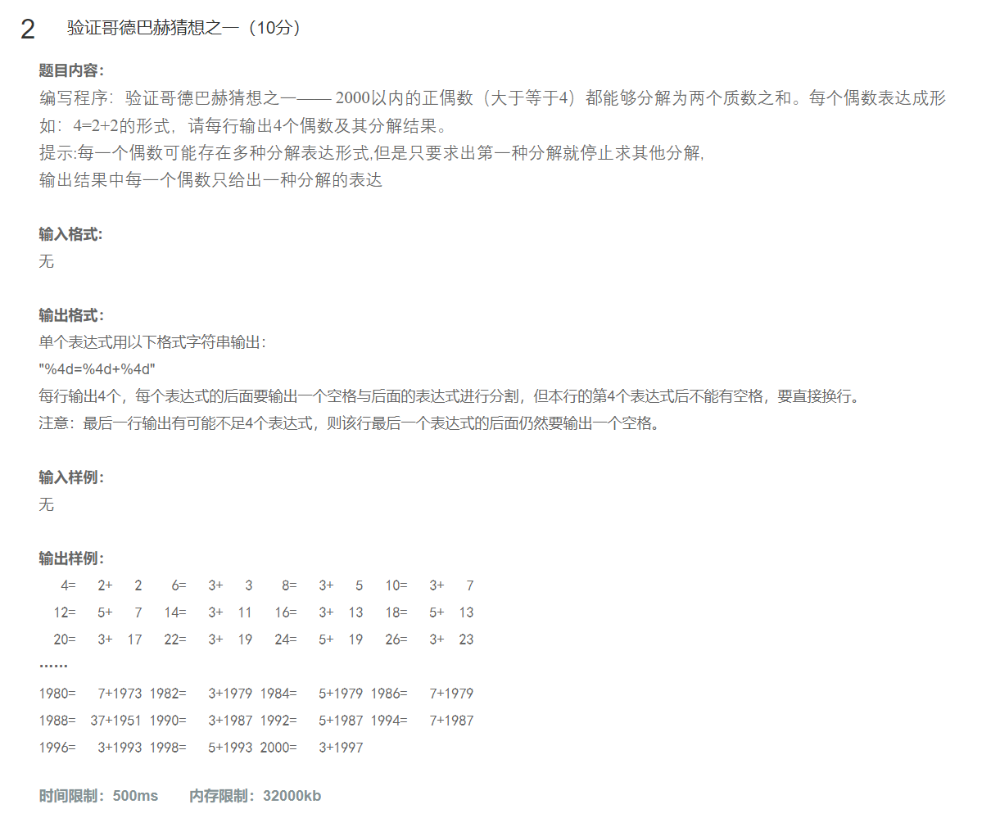

~~~c
#include<stdio.h>
#include<math.h>
int isPrime(int n)
{
	int i = 0;
	int k = (int)sqrt(n);
	if (n == 2)
	{
		return 1;
	}
	if (n % 2 == 0 || n == 1)
		return 0;
	for (i = 3; i <= k; i += 2)
	{
		if (n % i == 0)
			return 0;
	}
	return 1;
}
int main()
{
	int i = 4, j = 0, x = 0;
	for (i = 4; i <= 2000; i += 2)
	{
		//生成一个质数和（一个穷举一个检验）
		for (j = 2; j < i; j++)
		{
			if (isPrime(i - j) && isPrime(j)) {
				printf("%4d=%4d+%4d", i, j, i - j);
				x++;
				if (x % 4 == 0)
				{
					printf("\n");
					break;
				}
				printf(" ");
				break;
			}
		}
	}
	return 0;
}
~~~

> ### 算法基本步骤和流程
>
> 1. **定义判断函数 `isPrime`**：
>
>    - 该函数接收一个整数 `n`，用于判断 `n` 是否为素数。
>    - 如果 `n == 2`，直接返回 `1`（因为2是最小的素数）。
>    - 如果 `n` 是偶数或等于1，返回 `0`（因为除了2以外的偶数都不是素数，1也不是素数）。
>    - 使用 `for` 循环从3遍历到 `sqrt(n)`，以2为步长检查 `n` 是否能被任何奇数整除。如果找到任何因子，则返回 `0` 表示 `n` 不是素数；否则返回 `1`。
>
> 2. **主函数 `main`**：
>
>    - 初始化变量 `i` 为4，`j` 和 `x` 为0。`i` 用于遍历偶数，`j` 用于内层循环中的试探性加数，`x` 用于记录打印了多少个分解表达式。
>- 使用外层for循环从4遍历到2000，每次增加2以确保只处理偶数。
>       - 对于每个偶数 `i`，使用内层 `for` 循环从2遍历到 `i-1`，尝试找到两个素数 `j` 和 `i-j` 使得它们的和等于 `i`。
>      - 如果找到一对满足条件的素数，则打印出表达式 `i = j + (i-j)` 并增加计数器 `x`。
>             - 每当 `x % 4 == 0` 时（即每打印4个表达式后），换行以开始新的一行输出。
>      - 内层循环中一旦找到一对素数就立即 `break`，避免重复计算。
> 
> 
> 
>
>       
>3. **程序结束**：所有偶数都处理完毕后，程序正常结束。
> 
>    ### 关键操作或决策点解释
> 
> - **素数判断优化**：`isPrime` 函数通过检查小于等于 `sqrt(n)` 的所有奇数来确定 `n` 是否为素数，这提高了效率并减少了不必要的运算。
> - **偶数分解逻辑**：对于每个偶数 `i`，尝试将其分解为两个素数的和。一旦找到一对满足条件的素数，立即停止搜索并打印结果，保证了每个偶数只有一种分解方式被显示。
> - **换行逻辑**：使用 `x % 4 == 0` 来控制换行，确保每行最多打印4个分解表达式，使输出更加整齐美观。
>
> ### 注意事项
>
> - **性能问题**：尽管 `isPrime` 函数已经做了优化，但对于较大的偶数，仍然需要进行较多的素数判断。可以考虑预先生成一定范围内的素数表，以提高查找速度。
>- **格式化输出**：使用 `printf` 函数格式化输出分解表达式，确保每个数字占用固定宽度，使输出整齐易读。
> - **边界条件**：当前代码假设输入范围是从4到2000的偶数。如果需要处理更大的范围或不同的起始值，可能需要调整循环条件。
> - **算法正确性**：代码实现了哥德巴赫猜想的一个验证过程

## 题7：算算是第几天？

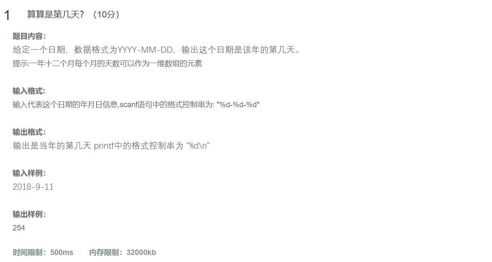

~~~c
#include<stdio.h>
int IRY(int a)
{
	if (a % 400 == 0 || (a % 4 == 0 && a % 100 != 0))
		return 29;
	return 28;
}
int count(int a, int b, int c)
{
	int x = c;

	switch (b - 1)
	{
	case 12: c += 31;
	case 11: c += 30;
	case 10: c += 31;
	case 9: c += 30;
	case 8: c += 31;
	case 7: c += 31;
	case 6: c += 30;
	case 5: c += 31;
	case 4: c += 30;
	case 3: c += 31;
	case 2: c += IRY(a);
	case 1: c += 31;
	}
	return c;
}
int main()
{
	int year = 0, month = 0, day = 0;
	scanf("%d-%d-%d", &year, &month, &day);
	int d = count(year, month, day);
	printf("%d", d);
	return 0;
}
~~~

> ### 算法基本步骤和流程
>
> 1. **定义闰年判断函数 `IRY`**：
>    - 该函数接收一个整数 `a`，表示年份。
>    - 根据闰年规则：如果年份能被400整除，或者能被4整除但不能被100整除，则返回29（表示2月份有29天）；否则返回28（表示2月份有28天）。
> 2. **定义累计天数计算函数 `count`**：
>    - 该函数接收三个参数 `a`（年）、`b`（月）、`c`（日），用于计算从年初到给定日期的总天数。
>    - 使用 `switch` 语句根据 `b-1` 的值逐月累加天数。注意这里的 `case` 语句没有 `break`，因此会“贯穿”执行所有匹配或后续的 `case`，直到结束。
>    - 调用 `IRY(a)` 函数获取2月份的天数，并在适当位置累加。
>    - 返回累加后的总天数 `c`。
> 3. **主函数 `main`**：
>    - 初始化三个整型变量 `year`、`month` 和 `day` 为 `0`，用于存储用户输入的年份、月份和日期。
>    - 使用 `scanf` 函数读取用户提供的日期，格式为 `年-月-日`。
>    - 调用 `count(year, month, day)` 计算从年初到给定日期的总天数，并将结果存储在 `d` 中。
>    - 使用 `printf` 函数打印出总天数 `d`。
> 4. **程序结束**：所有计算和输出完成后，程序正常结束。
>
> ### 关键操作或决策点解释
>
> - **闰年判断逻辑**：`IRY` 函数实现了标准的闰年判断规则，确保2月份的天数正确。
> - **累计天数逻辑**：`count` 函数使用 `switch` 语句累加每个月的天数。由于没有 `break` 语句，`switch` 会从匹配的第一个 `case` 开始一直执行到最后，从而正确地累加了从年初到指定月份的所有天数。
> - **日期输入**：使用 `scanf` 函数读取用户输入的日期，格式化字符串 `"%d-%d-%d"` 确保按正确的顺序读取年、月、日。
> - **输出显示**：直接使用 `printf` 函数输出计算得到的总天数。
>
> ### 注意事项
>
> - **`switch` 语句的行为**：`switch` 语句中没有 `break`，这意味着一旦匹配到某个 `case`，它将继续执行后续所有的 `case`，包括默认情况。这种行为在这里正是我们所需要的，因为它允许逐月累加天数。
> - **日期有效性验证**：当前代码假设用户会输入有效的日期。实际应用中应添加输入验证逻辑，以确保输入的日期是合法的（例如，月份应在1到12之间，日期应在对应月份的有效范围内等）。
> - **边界条件**：代码适用于公历（格里高利历）下的日期计算。对于特殊的历史日期或非公历系统，可能需要额外的处理逻辑。
> - **性能问题**：虽然这个算法对于大多数用途来说足够高效，但对于非常大量的日期计算，可以考虑优化或使用更高效的库函数。

## 题8：生成指定的数列

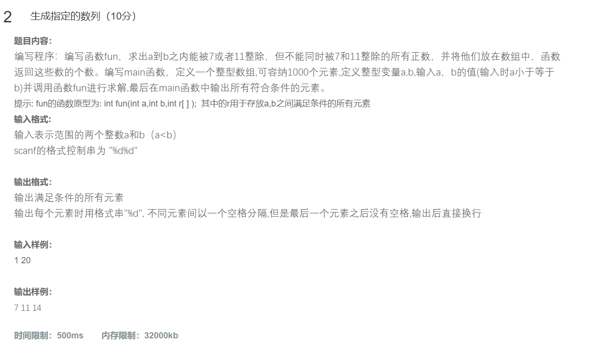

~~~c
#include<stdio.h>
int fun(int a, int b, int r[])
{
	int i = a, j = 0;
	for (; i <= b; i++)
	{
		if ((i % 7 == 0 || i % 11 == 0) && i % 77 != 0)
		{
			r[j] = i;
			j++;
		}
	}
	return j + 1;
}
void print(int* r)
{
	while (*r != 0)
	{
		printf("%d", *r);
		if (*(r + 1) == 0)
		{
			printf("\n");
			return;
		}
		printf(" ");
		r++;
	}
}
int main()
{
	int arr[1000] = { 0 };
	int a = 0, b = 0;
	do {
		scanf("%d %d", &a, &b);
	} while (a > b);
	fun(a, b, arr);
	print(arr);
	return 0;
}
~~~

> ### 算法基本步骤和流程
>
> 1. **定义筛选函数 `fun`**：
>    - 接收三个参数：起始整数 `a`、结束整数 `b` 和一个整型数组 `r[]`。
>    - 使用 `for` 循环从 `a` 遍历到 `b`。
>    - 对于每个整数 `i`，检查它是否满足条件：能被7或11整除但不能被77整除。
>    - 如果满足条件，则将其存入数组 `r[]` 中，并增加索引 `j`。
>    - 返回值为 `j + 1`，即实际存入数组中的元素数量加1。
> 2. **定义打印函数 `print`**：
>    - 接收一个指向整型数组的指针 `r`。
>    - 使用 `while` 循环遍历数组，直到遇到值为0的元素为止。
>    - 打印每个非零元素，并在最后一个元素后换行，在其他元素后添加空格分隔符。
> 3. **主函数 `main`**：
>    - 定义一个大小为1000的整型数组 `arr` 并初始化为0。
>    - 使用 `do-while` 循环确保用户输入的起始整数 `a` 不大于结束整数 `b`。
>    - 调用 `fun(a, b, arr)` 函数，筛选符合条件的数字并存储到数组 `arr` 中。
>    - 调用 `print(arr)` 函数打印数组中的结果。
> 4. **程序结束**：所有计算和输出完成后，程序正常结束。
>
> ### 关键操作或决策点解释
>
> - **筛选逻辑**：`fun` 函数中的条件 `(i % 7 == 0 || i % 11 == 0) && i % 77 != 0` 确保了只选择那些能被7或11整除但不能被77整除的数字。这避免了同时是7和11倍数的数字（即77的倍数）被选中。
> - **返回值处理**：`fun` 函数返回的是 `j + 1`，而不是实际存入数组的元素数量 `j`。这种设计可能是一个错误，因为通常我们会期望返回实际的元素数量，以便后续处理。
> - **打印逻辑**：`print` 函数通过检查 `*r` 是否为0来判断是否到达数组末尾，并在最后一个元素后换行。对于每个非零元素，它会打印出来并在元素间添加空格。
>
> ### 注意事项
>
> - **数组越界风险**：`fun` 函数假设数组 `r[]` 的长度足够大以容纳所有符合条件的数字。如果 `a` 和 `b` 之间的符合条件的数字超过数组容量，可能会导致数组越界问题。当前代码使用了一个长度为1000的数组，应该足够用于大多数情况，但仍需注意边界条件。
> - **返回值修正**：`fun` 函数返回 `j + 1` 可能不是预期的行为。建议修改为返回 `j`，即实际存入数组的元素数量，以便更准确地表示筛选结果的数量。
> - **输入验证**：`main` 函数中使用 `do-while` 循环确保用户输入的起始整数 `a` 不大于结束整数 `b`，这是一个好的实践，可以防止无效输入。
> - **格式化输出**：`print` 函数直接打印数组内容，没有特别限制小数位数或格式化输出。可以根据需求调整 `printf` 的格式化字符串来控制输出格式。

## 题9：求数组元素的平均值

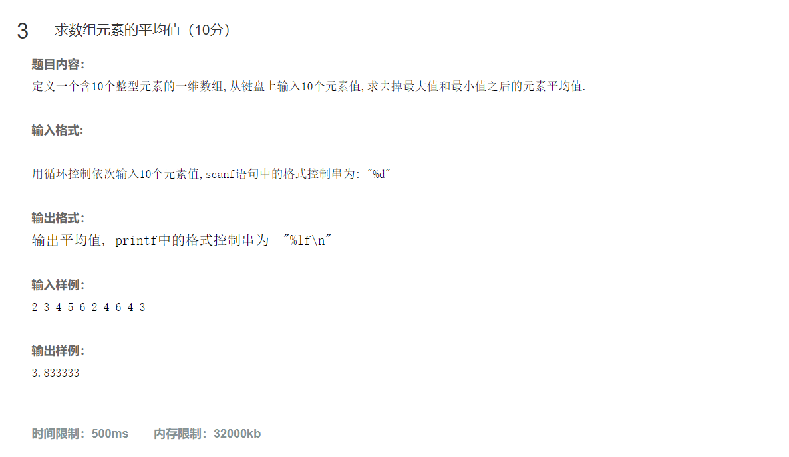

~~~c
//求数组的出去最值后的平均值
#include<stdio.h>
void get(int arr[], int i)
{
	int j = 0;
	for (j = 0; j < i; j++)
	{
		scanf("%d", &arr[j]);
	}
}
void maxmin(int arr[], int i, int* max, int* min)
{
	int j = 0;
	for (j = 0; j < i; j++)
	{
		if (arr[j] > *max)
			*max = arr[j];
		if (arr[j] < *min)
			*min = arr[j];
	}

}

double ALU(int arr[], int a, int b)
{
	int i = 0, sum = 0, x = 0, y = 0;
	for (i = 0; i < 10; i++)
	{
		sum += arr[i];
		if (arr[i] == a)
			x++;
		if (arr[i] == b)
			y++;

	}
	sum -= x * a + y * b;
	return sum / (10.0 - x - y);
}
int main()
{
	int arr[10] = { 0 };
	get(arr, 10);
	int max = arr[0], min = arr[0];
	maxmin(arr, 10, &max, &min);
	double mm = ALU(arr, max, min);
	printf("%lf\n", mm);
	return 0;
}
~~~

> ### 算法基本步骤和流程
>
> 1. **定义输入函数 `get`**：
>    - 接收一个整型数组 `arr[]` 和一个整数 `i`，用于读取用户输入的数组元素。
>    - 使用 `for` 循环从标准输入读取 `i` 个整数，并存储到数组 `arr[]` 中。
> 2. **定义最大最小值查找函数 `maxmin`**：
>    - 接收一个整型数组 `arr[]`、一个整数 `i` 和两个指向整型变量的指针 `max` 和 `min`。
>    - 使用 `for` 循环遍历数组，更新 `*max` 和 `*min` 为数组中的最大值和最小值。
> 3. **定义平均值计算函数 `ALU`**：
>    - 接收一个整型数组 `arr[]` 和两个整数 `a`（最大值）、`b`（最小值）。
>    - 使用 `for` 循环遍历数组，累加所有元素并记录最大值和最小值出现的次数。
>    - 计算总和减去最大值和最小值的总和，然后除以剩余元素的数量，返回平均值。
> 4. **主函数 `main`**：
>    - 定义一个大小为10的整型数组 `arr` 并初始化为0。
>    - 调用 `get(arr, 10)` 函数读取用户输入的10个整数。
>    - 初始化 `max` 和 `min` 为数组的第一个元素。
>    - 调用 `maxmin(arr, 10, &max, &min)` 函数找到数组中的最大值和最小值。
>    - 调用 `ALU(arr, max, min)` 函数计算去掉最大值和最小值后的平均值，并打印结果。
>
> ### 关键操作或决策点解释
>
> - **输入逻辑**：`get` 函数通过循环读取用户输入的10个整数并存储到数组中。
> - **最大最小值查找**：`maxmin` 函数通过遍历数组来更新最大值和最小值，确保在调用时正确地传递了指针。
> - **平均值计算**：`ALU` 函数计算去掉最大值和最小值后的平均值，但存在一些潜在问题（见下文）。
>
> ### 注意事项及问题
>
> 1. **`ALU` 函数的问题**：
>    - **硬编码的数组长度**：`ALU` 函数内部使用了硬编码的数组长度 `10`，这使得函数不够通用。应该接收数组长度作为参数。
>    - **重复计数**：如果最大值或最小值在数组中多次出现，`ALU` 函数会正确处理这些情况，但其逻辑可以简化和优化。
>    - **除零风险**：如果数组中所有元素都是相同的值（例如全为最大值或最小值），则可能导致除零错误。
> 2. **`maxmin` 函数的初始化**：
>    - 在调用 `maxmin` 函数之前，`max` 和 `min` 应该被初始化为合理的初始值。当前代码假设数组不为空且至少有一个元素，但如果数组为空或只有一个元素，可能会导致问题。

## 题10：数列移位

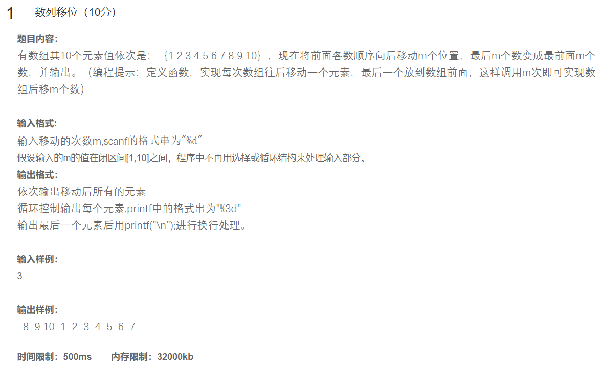

~~~c
#include<stdio.h>

void move(int arr[], int m, int brr[])
{
	int i = 0;
	for (i = 0; i < m; i++)
	{
		brr[i] = arr[10 - m + i];
	}
	for (i = 0; i < 10 - m; i++)
	{
		brr[m + i] = arr[i];
	}
}
void print(int brr[])
{
	int i = 0;
	for (i = 0; i < 10; i++)
	{
		printf("%3d", brr[i]);
		if (i == 9)
		{
			printf("\n");
		}
		
	}
}
int main()
{
	int arr[10] = { 1,2,3,4,5,6,7,8,9,10 };
	int brr[10] = { 0 };
	int m = 0;
	scanf("%d", &m);
	move(arr, m, brr);
	print(brr);
	return 0;
}

~~~

> ### 算法基本步骤和流程
>
> 1. **定义移动函数 `move`**：
>    - 接收三个参数：源数组 `arr[]`、移动长度 `m` 和目标数组 `brr[]`。
>    - 使用第一个 `for` 循环将 `arr` 中从位置 `10 - m` 开始到最后的 `m` 个元素复制到 `brr` 的前 `m` 个位置。
>    - 使用第二个 `for` 循环将 `arr` 中前 `10 - m` 个元素复制到 `brr` 的剩余位置。
> 2. **定义打印函数 `print`**：
>    - 接收一个指向整型数组的指针 `brr`。
>    - 使用 `for` 循环遍历数组并打印每个元素，确保最后一个元素后换行。
> 3. **主函数 `main`**：
>    - 定义一个大小为10的整型数组 `arr` 并初始化为 `{1, 2, 3, 4, 5, 6, 7, 8, 9, 10}`。
>    - 定义一个大小为10的整型数组 `brr` 并初始化为全0。
>    - 使用 `scanf` 函数读取用户输入的整数 `m`，表示要移动的元素数量。
>    - 调用 `move(arr, m, brr)` 函数执行元素移动操作。
>    - 调用 `print(brr)` 函数打印结果。
>
> ### 关键操作或决策点解释
>
> - **元素移动逻辑**：`move` 函数通过两个 `for` 循环实现元素的重新排列。第一个循环处理最后 `m` 个元素，第二个循环处理剩余的元素。
> - **打印逻辑**：`print` 函数通过遍历数组并格式化输出每个元素，确保最后一个元素后换行。
>
> ### 注意事项及问题
>
> 1. **边界条件**：
>    - 如果 `m` 大于10或小于0，可能会导致数组越界访问。应该添加检查以确保 `m` 在有效范围内（0 <= `m` <= 10）。
> 2. **数组长度固定**：
>    - 当前代码假设数组长度为10，如果需要处理不同长度的数组，应该考虑使代码更加通用。
> 3. **输入验证**：
>    - 用户输入的 `m` 应该进行验证，确保其在合理范围内。


## 题11：交换法排序

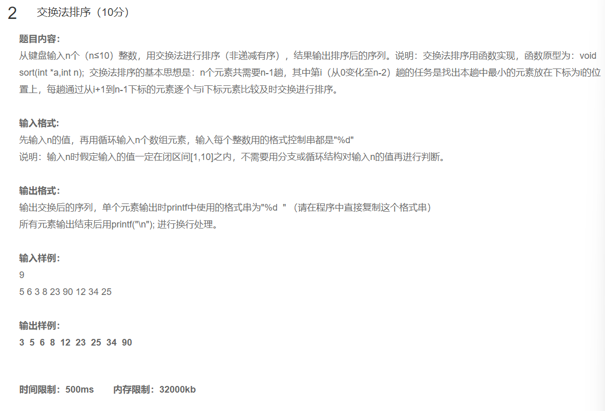

~~~C
#include<stdio.h>

void input(int arr[], int m)
{
	int i = 0;
	for (i = 0; i < m; i++)
	{
		scanf("%d", &arr[i]);
	}
}
void sort(int arr[], int m)
{
	int i = 0, j = 0;
	for (j = 0; j < m - 1; j++)
	{
		int min = j;
		for (i = j; i < m ; i++)
		{
			if (arr[i] < arr[min])
			{
				min = i;
			}
		}
		if (min != j)
		{
			int temp = arr[j];
			arr[j] = arr[min];
			arr[min] = temp;
		}


	}
}

void output(int arr[], int m)
{
	int i = 0;
	for (i = 0; i < m; i++)
	{
		printf("%d  ", arr[i]);
	}
	printf("\n");
}

int main()
{
	int m = 0;
	scanf("%d", &m);
	int arr[10] = { 0 };
	input(arr, m);
	sort(arr, m);
	output(arr, m);
	return 0;
}
~~~

> ### 算法基本步骤和流程
>
> 1. **定义输入函数 `input`**：
>    - 接收一个整型数组 `arr[]` 和一个整数 `m`，用于读取用户输入的 `m` 个整数。
>    - 使用 `for` 循环从标准输入读取 `m` 个整数并存储到数组 `arr[]` 中。
> 2. **定义排序函数 `sort`**：
>    - 接收一个整型数组 `arr[]` 和一个整数 `m`，用于对数组中的 `m` 个元素进行升序排序。
>    - 使用选择排序算法：外层循环遍历每个位置 `j`，内层循环找到从 `j` 到 `m-1` 的最小值，并将其与位置 `j` 的元素交换。
> 3. **定义输出函数 `output`**：
>    - 接收一个整型数组 `arr[]` 和一个整数 `m`，用于打印数组中的 `m` 个元素。
>    - 使用 `for` 循环遍历数组并格式化输出每个元素，确保最后一个元素后换行。
> 4. **主函数 `main`**：
>    - 读取用户输入的整数 `m`，表示要处理的数组长度。
>    - 定义一个大小为10的整型数组 `arr` 并初始化为0。
>    - 调用 `input(arr, m)` 函数读取用户输入的 `m` 个整数。
>    - 调用 `sort(arr, m)` 函数对数组进行排序。
>    - 调用 `output(arr, m)` 函数打印排序后的结果。
>
> ### 关键操作或决策点解释
>
> - **选择排序算法**：`sort` 函数使用了选择排序算法，该算法的时间复杂度为 O(n2)*O*(*n*2)，适用于小规模数据集。每次迭代找到当前未排序部分的最小值并与当前位置交换。
> - **输入和输出逻辑**：`input` 和 `output` 函数分别负责读取用户输入和打印结果，确保数据正确地进入和离开程序。
>
> ### 注意事项及问题
>
> 1. **数组越界风险**：
>    - 如果用户输入的 `m` 大于10，可能会导致数组越界访问。应该添加检查以确保 `m` 不超过数组的最大容量（即10）。
> 2. **输入验证**：
>    - 用户输入的 `m` 应该进行验证，确保其在合理范围内（例如 `0 <= m <= 10`），以避免数组越界或其他异常行为。
> 3. **数组初始化**：
>    - 当前代码假设数组长度固定为10，但实际使用的元素数量是 `m`。可以考虑动态分配内存或使用更灵活的数组处理方式。

## 题12：编写函数同时求两个整数的和与差

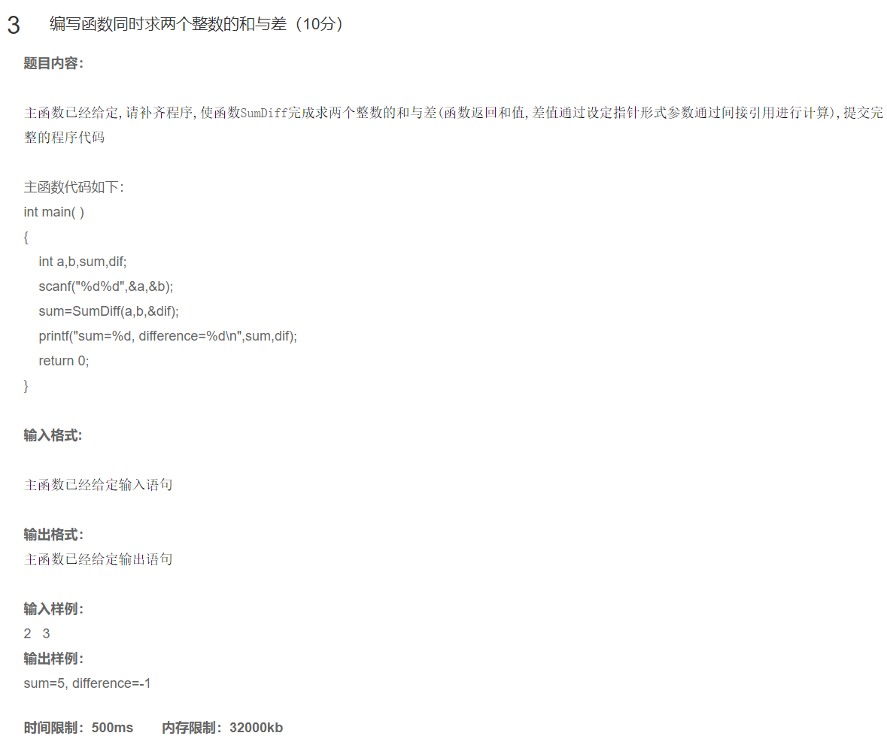

~~~c
#include<stdio.h>
int SumDiff(int a, int b,  int* dif)
{
	*dif = a - b;
	return a + b;
}
int main( )
{ 
    int a,b,sum,dif;
    scanf("%d%d",&a,&b);
    sum=SumDiff(a,b,&dif);
    printf("sum=%d, difference=%d\n",sum,dif);
    return 0;
}
~~~

> ### 算法基本步骤和流程
>
> 1. **定义 `SumDiff` 函数**：
>    - 接收三个参数：两个整数 `a` 和 `b`，以及一个指向整型变量的指针 `dif`。
>    - 计算 `a` 和 `b` 的差值，并通过指针 `dif` 返回该差值。
>    - 返回 `a` 和 `b` 的和。
> 2. **主函数 `main`**：
>    - 定义四个整型变量 `a`, `b`, `sum`, `dif`。
>    - 使用 `scanf` 函数读取用户输入的两个整数 `a` 和 `b`。
>    - 调用 `SumDiff(a, b, &dif)` 函数计算和与差，结果分别存储在 `sum` 和 `dif` 中。
>    - 使用 `printf` 函数打印出计算得到的和与差。
>
> ### 关键操作或决策点解释
>
> - **指针传递**：`SumDiff` 函数通过指针参数 `dif` 将差值返回给调用者，这是一种常见的C语言编程技巧，用于返回多个值。
> - **函数返回值**：`SumDiff` 函数返回 `a` 和 `b` 的和，这是通过常规的返回值机制实现的。
>
> ### 注意事项及问题
>
> 1. **输入验证**：
>    - 当前代码假设用户会输入有效的整数。实际应用中应添加输入验证逻辑，以确保程序的健壮性。
> 2. **格式化输出**：
>    - 使用 `printf` 函数时，确保格式化字符串与要打印的变量类型匹配。当前代码中的格式化字符串是正确的。
> 3. **变量初始化**：
>    - 变量 `sum` 和 `dif` 在使用之前没有显式初始化，但因为它们会被 `SumDiff` 函数赋值，所以这不会导致问题。不过，显式初始化是一种良好的编程习惯。
> 4. **函数命名和注释**：
>    - 函数名 `SumDiff` 已经相对清晰地描述了其功能，但仍可以考虑添加注释来提高代码的可读性。

## 题13：十进制转换十六进制

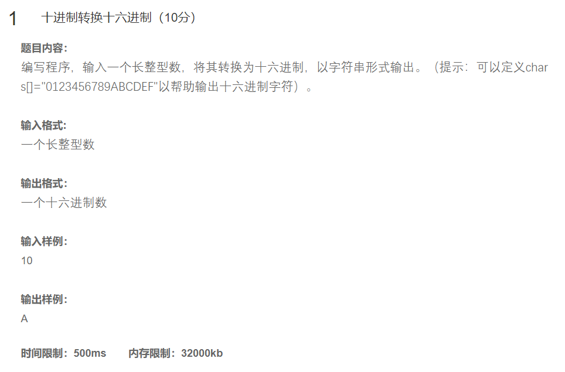

~~~c
#include<stdio.h>
char s[] = "0123456789ABCDEF";
void change(long a, char* m)
{
	static i = 0;
	if (a > 16)
	{
		change(a / 16, m);
	}
	
	m[i++] = s[a % 16];

}
int main()
{
	char m[10] = "0";
	long a = 0;
	scanf("%ld", &a);
	change(a, m);
	printf("%s", m);
	return 0;
}
~~~

> ### 算法基本步骤和流程
>
> 1. **定义全局字符数组 `s`**：
>    - 包含字符 `"0123456789ABCDEF"`，用于将数字映射到对应的十六进制字符。
> 2. **定义递归转换函数 `change`**：
>    - 接收两个参数：长整型变量 `a` 和指向字符数组的指针 `m`。
>    - 使用静态变量 `i` 作为索引，记录当前写入位置。
>    - 如果 `a` 大于16，则递归调用 `change(a / 16, m)`，处理高位。
>    - 将 `a % 16` 对应的十六进制字符存入 `m[i]` 并增加索引 `i`。
> 3. **主函数 `main`**：
>    - 定义一个大小为10的字符数组 `m` 并初始化为 `"0"`。
>    - 定义长整型变量 `a` 并读取用户输入的十进制数。
>    - 调用 `change(a, m)` 函数进行转换。
>    - 打印转换后的十六进制字符串。
>
> ### 关键操作或决策点解释
>
> - **递归逻辑**：`change` 函数通过递归调用自身来处理高位，直到 `a` 小于等于16。每次递归返回后，它会将当前位的十六进制字符添加到结果中。
> - **静态变量 `i`**：用于跟踪当前写入位置。由于它是静态变量，因此在所有递归调用之间共享同一个值。
> - **字符映射**：使用全局字符数组 `s[]` 将数字映射到对应的十六进制字符。
>
> ### 注意事项及问题
>
> 1. **静态变量的问题**：
>    - 静态变量 `i` 在函数调用之间保持其值，这可能导致多次调用 `change` 时出现意外行为。建议将索引用作参数传递或局部变量处理。
> 2. **字符数组 `m` 的终止符**：
>    - 当前代码没有在 `m` 数组末尾添加字符串终止符 `\0`，这会导致 `printf` 打印时可能出现未定义行为。
> 3. **数组越界风险**：
>    - 如果输入的数字非常大，可能会导致 `m` 数组越界。应该确保 `m` 数组有足够的空间容纳转换后的字符串。
> 4. **初始值 `"0"`**：
>    - 初始化 `m` 数组为 `"0"` 可能会在最终输出中产生不必要的字符。建议初始化为空字符串或动态调整数组大小。

## 题14：字符串过滤

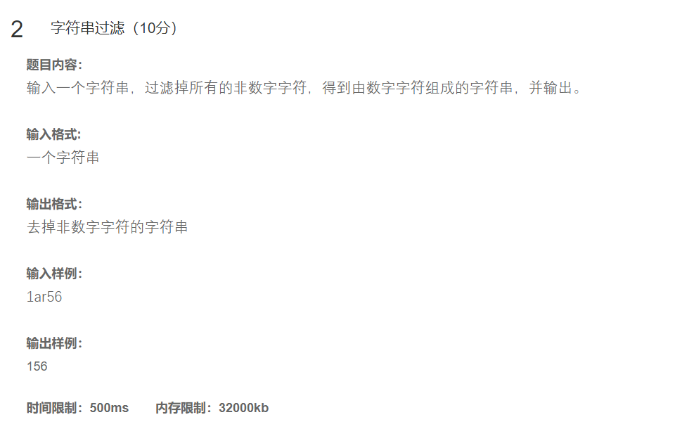

~~~c
#include<stdio.h>
void print(char p[])
{
	char* t = p;
	while (*t != '\0')
	{
		if (*t >= '0' && *t <= '9')
			printf("%c", *t);
		t++;
	}
}
int main()
{
	char p[10] = "\0";
	scanf("%s", p);
	print(p);
	return 0;
}
~~~

> ### 算法基本步骤和流程
>
> 1. **定义打印函数 `print`**：
>    - 接收一个字符数组 `p[]` 作为参数。
>    - 使用指针 `t` 遍历字符数组 `p[]`，直到遇到字符串终止符 `\0`。
>    - 如果当前字符是数字（即在 `'0'` 到 `'9'` 之间），则打印该字符。
> 2. **主函数 `main`**：
>    - 定义一个大小为10的字符数组 `p` 并初始化为空字符串。
>    - 使用 `scanf` 函数读取用户输入的字符串并存储到 `p` 中。
>    - 调用 `print(p)` 函数提取并打印所有数字字符。
>
> ### 关键操作或决策点解释
>
> - **字符遍历逻辑**：`print` 函数使用指针 `t` 遍历字符数组 `p[]`，检查每个字符是否为数字字符，如果是，则打印出来。
> - **输入处理**：`main` 函数通过 `scanf` 函数读取用户输入的字符串。
>
> ### 注意事项及问题
>
> 1. **数组越界风险**：
>    - 当前代码将字符数组 `p` 的大小固定为10，并且没有检查用户输入的长度。如果用户输入的字符串超过9个字符（加上终止符 `\0`），可能会导致数组越界写入，从而引发未定义行为。建议增加对输入长度的限制或使用更安全的输入方法如 `fgets`。
> 2. **空输入处理**：
>    - 如果用户输入为空字符串，程序不会输出任何内容，这可能是预期的行为，但可以考虑添加提示信息以提高用户体验。
> 3. **格式化输出**：
>    - 当前代码直接连续打印数字字符，没有分隔符或其他格式化处理。如果需要更美观的输出，可以在数字字符间添加空格或换行。
> 4. **初始化问题**：
>    - 字符数组 `p` 初始化为 `"\0"` 是多余的，因为后续的 `scanf` 会覆盖这个值。可以直接声明而不初始化。


## 题15：带宏替换计算给定的二月天数

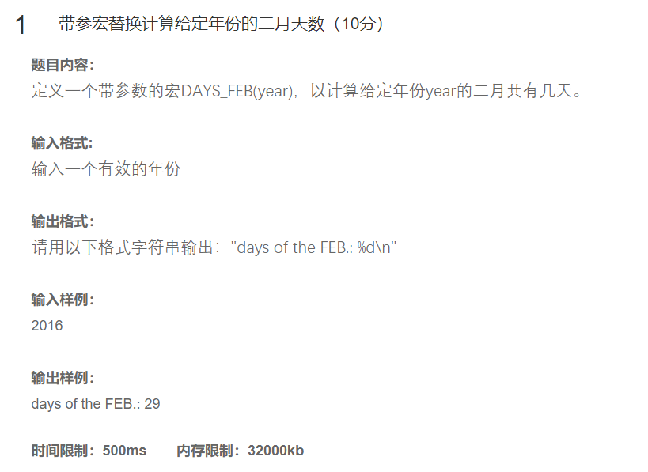

~~~c
#define DAYS_FEB(year)  28 
int main()
{
	int y = 0;
	scanf("%d", &y);
	int d = DAYS_FEB(y);
	if ((y % 4 == 0 && y % 100 != 0) || y % 400 == 0)
		++d;
	printf("days of the FEB.: %d\n", d);
	return 0;
}
~~~

> 思路：
>
> - **读取用户输入**：从标准输入读取一个整数 `y`，表示年份。
> - **初始化二月份天数**：使用宏 `DAYS_FEB(y)` 初始化变量 `d` 为28。
> - **检查是否为闰年**：根据闰年规则（能被4整除但不能被100整除，或者能被400整除），如果年份 `y` 是闰年，则将 `d` 增加1。
> - **打印结果**：输出计算后的2月份天数。


> 其实我觉得这是一个很扯的代码，因为这个并不像我们设想的可能有一个宏，能够实现我们原来一个函数的功能，我写的时候觉得这个并不是题目所设想我们去写的，但是最终成功了，很出乎意料

> 改进方案： 
>
> //\#define DAYS_FEB(year) ((year) % 4 == 0 && ((year) % 100 != 0 || (year) % 400 == 0) ? 29 : 28)
>
> > 利用三目运算符可以巧妙地完成这个任务


## 题16：学生平均成绩的计算和输出


~~~c
typedef struct stu
{
	int a;
	char arr[10];
	int brr[3];
}stu;
void input(stu* p, int a)
{
	int i = 0;
	for (i = 0; i < a; i++)
	{
		scanf("%d %s %d %d %d", &(p->a), p->arr, &(p->brr[0]), &(p->brr[1]), &(p->brr[2]));
		p++;
	}
}
int* average(stu* p, int a,int* b)
{
	int i = 0;

	for (i = 0; i < a; i++)
	{
		b[i] = (p[i].brr[0] + p[i].brr[1] + p[i].brr[2]) / 3;
	}
	return b;
}
void output(int* crr, int a)
{
	int i = 0;
	for (i = 0; i < a; i++)
	{
		printf("The average score of the %dth student is %d.\n", i + 1, crr[i]);
	}
}
int main()
{
	int a = 0;
	do {
		scanf("%d", &a);
	} while (a < 0 || a>10);
	stu arr[10];
	//输入
	input(arr, a);
	//计算平均分
	int b[10] = { 0 };//将数组放在外面可以避免函数销毁时，数组的丢失
	 average(arr, a,b);
	//输出
	output(b, a);
	return 0;
}

~~~

> ### 算法基本步骤和流程
>
> 1. **定义结构体 `stu`**：
>    - 包含一个整数 `a`，一个长度为10的字符数组 `arr`，以及一个长度为3的整数数组 `brr`。
> 2. **定义输入函数 `input`**：
>    - 接收一个指向结构体 `stu` 的指针 `p` 和一个整数 `a`，用于读取 `a` 个学生的信息。
>    - 使用 `for` 循环遍历每个学生，使用 `scanf` 函数读取并存储每个学生的信息。
> 3. **定义平均分计算函数 `average`**：
>    - 接收一个指向结构体 `stu` 的指针 `p`、一个整数 `a` 和一个指向整型数组的指针 `b`。
>    - 计算每个学生的平均分，并将结果存储在数组 `b` 中。
>    - 返回数组 `b` 的指针。
> 4. **定义输出函数 `output`**：
>    - 接收一个指向整型数组的指针 `crr` 和一个整数 `a`，用于打印每个学生的平均分。
> 5. **主函数 `main`**：
>    - 定义一个整型变量 `a` 并初始化为0，用于存储学生数量。
>    - 使用 `do-while` 循环确保用户输入的学生数量在合理范围内（0到10）。
>    - 定义一个大小为10的结构体数组 `arr` 用于存储学生信息。
>    - 调用 `input(arr, a)` 函数读取学生信息。
>    - 定义一个大小为10的整型数组 `b` 用于存储平均分。
>    - 调用 `average(arr, a, b)` 函数计算平均分。
>    - 调用 `output(b, a)` 函数打印平均分。
>
> ### 关键操作或决策点解释
>
> - **结构体定义**：`stu` 结构体用于组织每个学生的信息，包括整数、字符串和数组。
> - **输入逻辑**：`input` 函数通过循环和 `scanf` 函数读取并存储每个学生的信息。
> - **平均分计算**：`average` 函数通过遍历结构体数组计算每个学生的平均分，并将结果存储在另一个数组中。
> - **输出逻辑**：`output` 函数通过遍历数组并格式化输出每个学生的平均分。
>
> ### 注意事项及问题
>
> 1. **输入验证**：
>    - 当前代码假设用户会输入有效的数据。实际应用中应添加输入验证逻辑，以确保程序的健壮性。特别是对于字符串输入，应该限制其长度以避免缓冲区溢出。
> 2. **数组越界风险**：
>    - 如果用户输入的学生数量超过10，可能会导致数组越界访问。当前代码已经通过 `do-while` 循环限制了输入范围，但仍需注意边界条件。
> 3. **`scanf` 安全性**：
>    - 使用 `scanf` 读取字符串时，应该指定最大宽度以防止缓冲区溢出。例如，使用 `%9s` 来限制字符串的最大长度为9个字符（加上终止符 `\0` 共10个字符）。
> 4. **代码可读性和维护性**：
>    - 添加注释和适当的空行可以提高代码的可读性和维护性。

## 总结

本文旨在为寻求帮助的同学一个参考，但并非是最优解。其中，文本解释部分有通义负责。我代码方案中有很多都是很无趣的代码。但是每一个代码都是通过oj并成功。你可以**略微参考**。——Ttzs