# 指针（入门+基础）

## 阅读指南

如果您是一位**大佬**，这篇文章属于**基础型**的，可能并**不适合**您；

如果您是一位**已经学过**的同学，但是**不确定是否扎实**，想检验自己的学习效果，建议直接阅读**无\* 的部分(一些基础问题)**进行举例论证和道理论证，进行自我检验

如果您是**着急考试**的同学，建议阅读**框框的内容**，进行快速**复习知识点**，对于**部分代码**可以快速浏览

如果您是**初步接触**的同学，建议您**阅读全文**，相信您会有一定收获

如果您发现文章上由任何的问题，即可反馈到我的邮箱ttzs001@outlook.com，我会在**3个工作日内**尽快给您回复

## 前言

1. **指针是什么？**
2. **指针变量是什么？**
3. **\* 和\& 的含义是什么？**
4. **指针有没有丰富的类型？**
5. **常见的指针的使用错误以及如何规避一些错误？**
6. **指针是否可以进行运算呢？运算有哪些类别呢？**
7. **指针和数组的对应关系？**

## 指针的定义

首先，我们要回答：**指针是什么？**

先上结论，再给您解释。

> 本质上，**指针**就是**地址**，即**最小内存单元的编号**

### 地址

 先看一个常见的例子

~~~c
#include<stdio.h>
int main()
{
    int a=0;
    scanf("%d",&a);
    return 0;
}
~~~

* 我们经常在scanf中，使用&（取地址符），那么大家有没有想过地址是什么？

* 人有身份证编号，小区也有自己的地址，每一个对象在这个世界有了一个唯一可以识别的坐标，或者说编号

* 我们能够通过编号快速找到这个编号所属的对象

  代码中，我们的对象是数据类型、函数等

  我们通过地址对对象快速访问

  我们通过&a(拿出a的地址)，快速对a进行操作

> 对于**地址**的理解：
> ​		第一层，地址是对象|内存的一个**编号**
> ​		第二层，对变量进行抽象，忽略内部信息，匹配的一个能够快速访问的**抽象值**，也就是地址
> 		第三层，指针类似于**[超链接]()**(不知道内部的信息，但可以通过这个快速访问)|该超链接没有链接任何内容，所以点不开

那么，问题来了，**选取多大的内存生成地址呢？**  **地址是哪儿来的？**

先上结论：

> **程序运行**在内存中，而内存被划分为一个个的内存单元，一个内存单元的大小是1个字节，**每个内存单元都有自己的编号**

> **地址**是由**计算机硬件**对于每一个**最小内存单元**(1byte)进行生成的**编号**
>
> 地址不能随意修改

* 在常用数据类型中，最小的数组类型的大小是char，即1byte；我们可以讲，对象是byte层级。
* 如果我们对于1bit进行生成地址，那么简单的char就会生成8个地址，那么后面的更大的函数就使用，更多的地址；
* 如果我们使用更大尺寸的，例如：1kb，那么基本的数据类型，如：int等，就难以快速访问
* 简单的类比，对试卷的分类放到一个文件夹：如果根据每一个试卷的题目进行分类，那么分不分都类似，无法下次快速拿去；如果根据文科、理科进行区分，还是有些难度；但是如果根据科目进行分类，似乎好很多。

那么，似乎又有问题了，对int这样的“多地址”类型，取地址时取那个呢？

我们来实际上查看一下内存

~~~c
#include<stdio.h>
int main()
{
	int a = 0;
	scanf("%d", &a);
	printf("%p", &a);
	return 0;
}
~~~

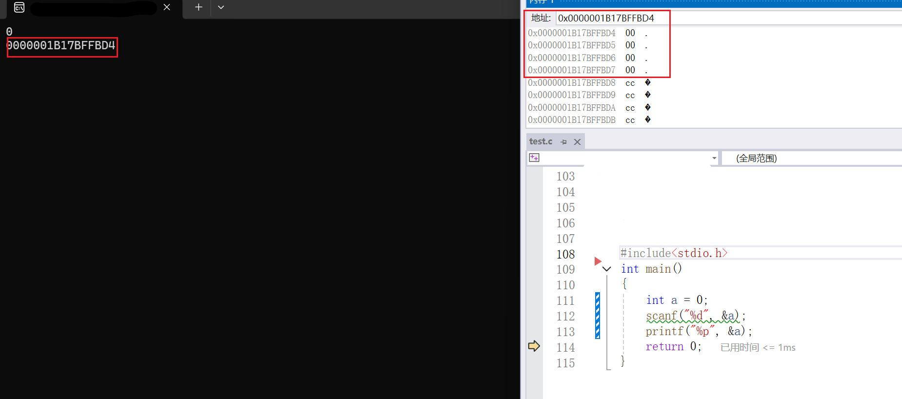

> **%p**表示以指针(16进制)的形式打印

> 实践证明，内存中，选取**对象的****首地址**作为对象的地址

* 同时我们也观察到了地址的形式

> 地址以16进制的形式显现，在内存中是2进制的

大家是否好奇**地址是如何产生的？**

* 以32位机器为例，32位机器拥有32跟地址总线，每根地址总线的产生高低压，即0(低压)和1(高压)两个信号。
* 一共有2^32 个结果，即2^32 个地址(对应2^32 个内存单元)，每个地址1个字节
* 因此，内存为2^32 byte ，即4GB；而指针的大小是4bytes
* 同样可知，64为机器，可以利用的内存大约是4EB，当然目前的实际上没有这么多；而指针的大小是8bytes
* 更多底层内容，参考[内存地址_百度百科](https://baike.baidu.com/item/内存地址/7354236)

~~~c
#include<stdio.h>
int main()
{
	int a = 0;
	char b = '0';
	long c = 0;
	double d = 0;
	printf("%d\n%d\n%d\n%d\n", sizeof(&a), sizeof(&b), sizeof(&c), sizeof(&d));
	return 0;
}
~~~

结果图

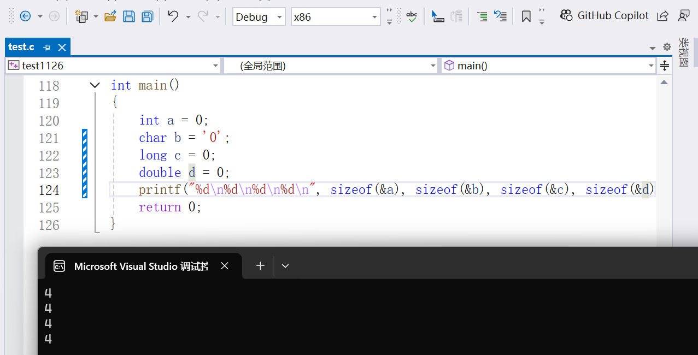

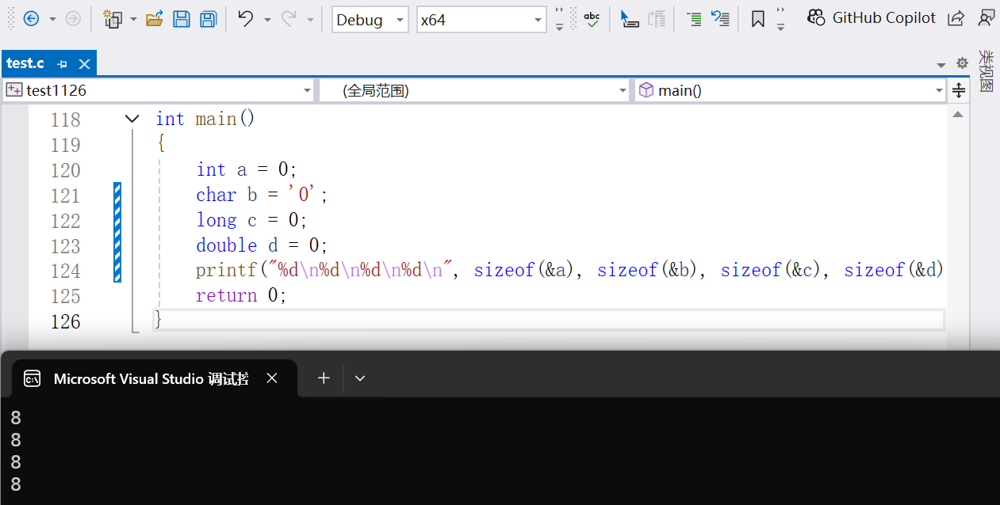

> **指针的大小**只跟**环境**有关，与**数据类型**无关
>
> **x32(x86)**的环境下，指针的大小是**4bytes**
>
> **x64**			的环境下，指针的大小是**8bytes**

## 指针变量的定义

起始问题，指针变量是什么？

* 过去，我们讲整形变量、字符变量、浮点型的变量等，为什么呢？
* 首先，变量是在内存中开辟一个空间，存储一些数据，但是这些数据的类型是类型
* 存储整形的变量叫做整形变量；存储字符的变量叫做字符变量
* 自然地：

> 存储一个**指针**的变量，就是**指针变量**
>
> 指针变量存放的就是地址
>
> 同时，我们也会简答地把指针变量简述成"指针"
>
> 我们把第一节的指针，称作**(常)指针**

C语言中，我们如何定义一个指针变量呢?

> 指针的定义：**指针的预计指向的对象的类型\*  标识符 ;**

~~~c
#include<stdio.h>
int main()
{
	int* pi ;
    char* pc;
    long* pl ;
	double* pd ;
	return 0;
}
~~~

* 语句表示：我们定义了一个指针，名字叫px（x=i c l d）,指向相应的对象
* 不过此时的指针都未指针指向某个内容，是不定项，也是不安全的
* 我们建议，定义指针时同时对其初始化，类似于普通对象(变量、数组)
* 如果知道指向对象，直接初始化
* 如果不知道指向的对象，建议NULL(类似于0)

~~~c
#include<stdio.h>
int main()
{
	int a = 0;
	int* pi = &a;
	char b = '0';
    char* pc = &b;
	long c = 0;
    long* pl = &c;
	double d = 0;
	double* pd = &d;
    int* pmx=NULL;
	return 0;
}
~~~

* 指针的初始化和定义能够分离，但是不建议

> 指针创建的模型： **对象的类型\* 标识符=&对象;**
>
> ​											**未来对象的类型\* 标识符=NULL;**

## 运算符的说明

起始问题，\* 和\& 的含义是什么？

> \* 的两个场景：**定义时，表明定义的说指针变量，实际上是用来指定一个变量是指向某个类型的指针**
>
> ​								***指针时，解引用操作符，表示对指针进行解引用**
>
> **&的意思是，取地址符**

* 简单的理解是，\* 是指针的牌面，独一无二的运算符，用来进行声明很合适；

如何理解解引用呢？

* 我们之前谈指针时，将指针类似与超链接、更高维的抽象，解引用就是具象化指针指向的对象的内容，相当于点击超链接
* 取地址，相当于对对象进行抽象

## 指针类型

起始问题，不同的指针有没有区别？举例例证

* 第一节中，提到**指针可以类比为超链接**，不同超链接后的内容是不同的，但与此同时，每个超链接的大小都是相同的

我们不由发问：指针有没有类型？
 首先，既然指针的大小是相同，为什么不同用其他类型的进行指向

~~~c
#include<stdio.h>
int main()
{
	int a = 260;
	char* pa = &a;
	printf("%d", *pa);
	return 0;
}
~~~

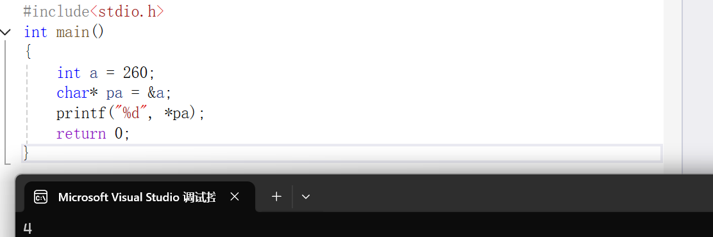

* 根据结果图和警告图⚠，我们会发现，这显然是不可以的，并且int\*和char\* 的类型是不同的

数据被遗弃的原因是什么呢？

> **指针类型**的差异不决定指针的大小
>
> 决定了看待对象的角度，即**决定了指针再被解引用的时候访问几个字节**

* 解释说明：
* 260以二进制补码(原码、反码一致)存储到整形变量a中，即0001 0000 0100
* 将&a赋值给pa后，对pa解引用时，由于pa是char\* 只能访问一个字节，所以是0100 就是4

> **对指针进行强制类型转换，会对大型数据有微观的认识**

> 如果是int* 的指针，解引用访问4个字节
>
> 如果是char*的指针，解引用访问1个字节
>
> 推广到其他

有人这是要提问：同学，char和int跨度很大，自然不能混用对应的指针；那float和int的大小类似，数据类似，能不能混用呢？

~~~c
#include<stdio.h>
int main()
{
	int a = 6;
	float b = 6.0f;
	int* pa = &a;
	int* pb = &b;
	printf("%d\n%d", *pa, *pb);
	return 0;
}
~~~

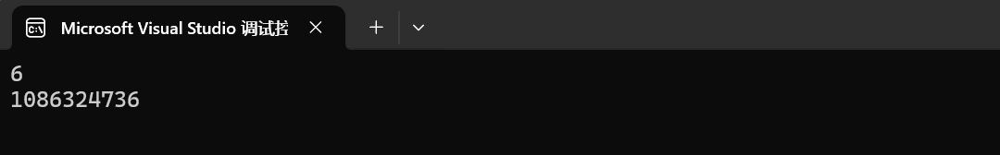

~~~c
#include<stdio.h>
int main()
{
	int a = 6;
	float* b = &a;
	printf("%d\n", a);
	printf("%d\n", *b);
	printf("%f\n", *b);
	*b = 6.0f;
	printf("%d\n", a);
	printf("%d\n", *b);
	printf("%f\n", *b);
	return 0;
}
~~~

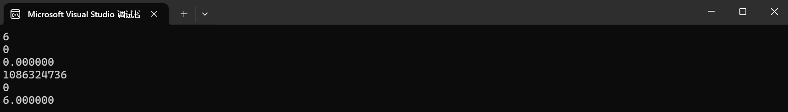

* 仅从数据就能够知道，数据再次时失真
* int float 底层原理上的不同，即存储方式的不同；**一种数据，难以被读取另一种数据的方式读取**

> 总结：
>
> 不同的类型的指针是不同的，影响其读取的角度
>
> 指针的内存大小都相同，只跟环境相关
>
> 指针指向的对象的大小，或者说访问的内存的大小是不同的

## 指针的建议使用规范

起始问题：常见的指针的使用错误以及如何规避一些错误？

* 第一类，定义指针，但初始化不完全

~~~c
#include<stdio.h>
int main()
{
	int* pa;
	*pa = 6;
	return 0;
}
~~~

* 编辑器报错，指针为初始化，其指向的对象是随机的，即超链接了一个随便的位置，无权限读写
* 其实很好理解，假如你被随机传送陌生人的门口，你可以随便进去，或者在别人家里画画吗？
* 如果初始化的时NULL，同样时不完全初始化的

~~~c
#include<stdio.h>
int main()
{
	int* p = NULL;
	*p = 6;
	return 0;
}
~~~

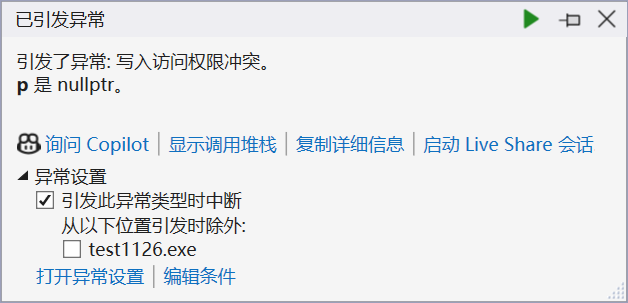

* 0地址时不能被访问的，如果强行进行写入，会发生下入访问权限冲突

* 第二类，数组越界访问

~~~c
#include<stdio.h>
int main()
{
	int arr[10] = { 0 };
	int* p = arr;
	int i = 0;
	for (i = 0; i < 12; i++)
	{
		*p = i;
		p++;
		printf("%d  ", *p);
	}
	return 0;
}
~~~

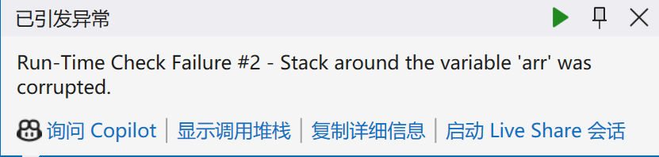

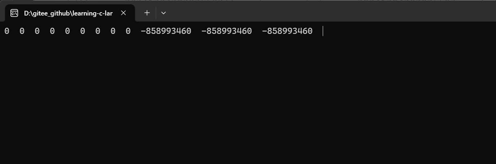

* 这串代码中，明显有误
* 越界访问了数组，超出了arr的范围；
* 越界访问本身是不会被编译器报错的，但是会对程序造成很多问题，功能无法正常实现
* 第三类：指针指向的空间释放

~~~c
#include<stdio.h>
int* t()
{
	int a = 6;
	return &a;
}
int main()
{
	int* p = t();
	printf("%d", *p);
	return 0;
}
~~~

* t()函数临时创建了一个a，函数功能结束时，空间释放，a的生命周期和作用域应该截至
* t()返回的地址，应该时无法访问
* 此后这块空间的权限不在，但内存空间还在，数据有可能还在里面

* 我们进行简单的修改

~~~c
#include<stdio.h>
int* t()
{
	int a = 6;
	return &a;
}
int main()
{
	int* p = t();
	int b = 1 + 2;
	printf("%d\n", b);
	printf("%d", *p);
	return 0;
}
~~~

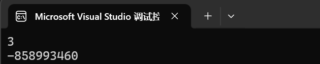

* 结果很明显，p可以获得地址，可以找到这块内存，但是无法访问和修改权限，具体的原理：参考[函数栈帧的创建与销毁（超详解）-CSDN博客](https://blog.csdn.net/qq_61635026/article/details/124384367)

> 我们称上述缺少写入权限的指针，也可能缺少读入权限的指针为野指针
>
> **野指针**的类型：**指针未初始化；数组越界访问；指针指向的空间释放**

如何避免野指针的出现的一般情况呢？

> 优秀的指针使用指南：
>
> 1. **及时赋值**
> 2. **使用前检验**
> 3. **使用assert函数**
> 4. **小心指针越界**
> 5. **避免返回局部变量的地址**
> 6. **指针使用前要检查有效性**

* 指针的检验

~~~c
#include<stdio.h>
int main()
{
	int* p = NULL;
	if (*p != NULL)
	{
		*p = 6;
	}
	return 0;
}
~~~

* 对于NULL的判断处，也可以使用 （*p）但不推荐

* 还有一种方法就是使用assert函数

~~~c
#include<stdio.h>
#include<assert.h>
int main()
{
	int* p = NULL;
	assert(p != NULL);
	*p = 6;
	return 0;
}
~~~

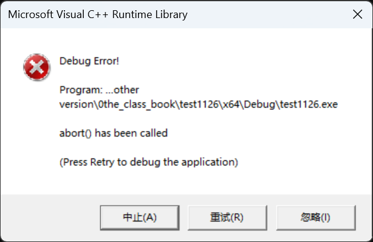

* 这一种，更加直接
* 以上两种都可以有且尽可以实现空指针的检验，其他类型的野指针还是要靠自己检查

## 指针的运算

指针是否可以进行运算呢？运算有哪些类别呢？

> 在C11标准中，**指数的运算的对象是类似的，或者是数组中的元素**

### 关系运算和算数运算

* 指针间进行关系运算，说人话就是，比地址大小；算数运算就是+-一个常数以及++|--
* 先将一个简单的部分：指针+-整数
* 因而，我们将数组中讲解

~~~c
#include<stdio.h>
int main()
{
	int arr[3][3] = { {1,1,1},{2,2,2},{3,3,3} };
	int* p0 = &arr[0][0];
	int (*p1)[3] = arr;
	int (*p2)[3][3] = &arr;
	int (*p3)[3] = &arr[0];
	int* p4 = arr[0];
	printf("%p  \n", p0);
	printf("%p  \n", p0 + 1);
	printf("%p  \n", p1);
	printf("%p  \n", p1 + 1);
	printf("%p  \n", p2);
	printf("%p  \n", p2 + 1);
	printf("%p  \n", p3);
	printf("%p  \n", p3 + 1);
	printf("%p  \n", p4);
	printf("%p  \n", p4 + 1);
	return 0;
}
~~~

* 结果图：
* !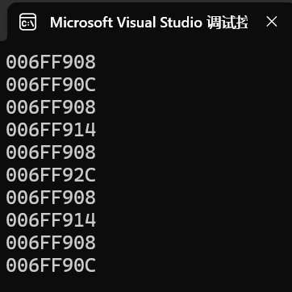
* 我们发现：
* 1. p0 p1 p2 p3 p4 的大小和类型和指向的地址在结果上似乎是一致的
  2. 但是+1：相差了很多；
     	1. p0是首元素的地址；抽象的是一个int
      	2. p1是二维数组名，本质是首行的地址；抽象的是一个int [3]
      	3. p2是数组的地址；抽象的是一个一个数组，类型是int \[3][3]
      	4. p3是第一行的地址；抽象的是一个行，类型数int \[3](这个3 是列)
      	5. p4是第一行的数组名，本质上是第一行的第一个元素，等价于首元素的地址；抽象的是int \[3][3]

> summary：
>
> **指针+-整数=指针+-整数\*sizeof（对象）**
>
> 程序中，我们建立的只有一维数组，二维数组是一堆一维数组的指针构成的数组
>
> 因此:
>
> **数组名代表数组一维数组的首元素地址**
>
> ​	**数组名+-（整数）=数组【整数】**
>
> **&指针——>指向整个对象**

* 对于更为复杂的++和--以及关系元素；我们将在一起通过三个例子讲解

#### 例题0

~~~c
#include<stdio.h>
int main()
{
	float arr[5] = { 0 };
	float* p = arr;
	for (; p < &arr[4] + 1; )
	{
		*p++ = 0;
	}
	return 0;
}
~~~

* 首先对表达式进行简单的解释：后置++，先及逆行其他运算在进行++；最终*p =0;p++
* 其次时功能的实现，代表这可以进行比较
* 补充:
* \*p ++  :p先进行解引用；p++；单独的这样的式子实际效果就是p++;如果还有别的式子，那另当别论。
* (* p)++：p指向的对象进行++

#### 例题1

* 来个例题练习刚刚学习的知识点

~~~c
#include<stdio.h>
int main()
{
	float arr[5];
	float* p;
	for (p = &arr[0]; p < &arr[5];)
	{
		*p++ = 0;
	}
	return 0;
}
~~~

* 对这个代码，进行解释。
* 这段代码实际：1. 创建了一个浮点数组和指向浮点数的指针；2. 使用指针遍历整个数组;3. 赋值p指向的数组为0.0；
* 简单点说，就是初始化一个浮点数组；

有心细的小伙伴会问：这个数组是不是越界访问了？ 

* 其实并没有，我们没有对arr[5]进行任何形式的赋值，只是单纯地借用这个连续的地址；如果你觉得不舒服，可以简单点写成&arr[4]+1;这两个表达式的效果时等价的

> C11中，规定C语言**允许有一个特殊的指针值，它指向一个数组最后一个元素之后的位置。这个指针可以用于指针比较和算术，但它不能用来解引用（即不能用 \*  来访问数据）**
>
> **后数组指针只可比和可读，不可写入**

小T问问大家：关于初始化一个数组，你能想到多少种方案呢，欢迎讨论？

* 方案一

~~~c
#include<stdio.h>
int main()
{
	float arr[5];
	int p = 4;
	for (; p >= 0; p--)
	{
		arr[p] = 0.0;
	}
	return 0;
}
~~~

* 方案二:利用前置减减进行代码上的优化，可能大小上变化比较小

~~~c
#include<stdio.h>
int main()
{
	float arr[5];
	int p = 4;
	for (; p >= 0; arr[p--] = 0)
	{
		;
	}
	return 0;
}
~~~

.....（小T能力有限，等待大佬们开发有趣的方法）

#### 例题2

* 再来一段练练数组和指针对于同样问题的区别

~~~c
#include<stdio.h>
int main()
{
	int arr[10] = { 0 };
	int i = 0;
	int sz = sizeof(arr) / sizeof(arr[0]);
	for (i = 0; i < sz; i++)
	{
		arr[i]++;
	}
	return 0;
}
~~~

* 简单点说就是，初始化为1；

~~~c
#include<stdio.h>
int main()
{
	int arr[10] = { 0 };
	int sz = sizeof(arr) / sizeof(arr[0]);
	int* p = &arr[0];
	for (; p < &arr[10];)
	{
		++*p++;
	}
	return 0;
}
~~~

* 这串代码的吸引点就是在于++和\* 混合使用
* ++\*p++   <=\=\=> ++(*p++)     \<=\==>   p先解引用，获得\*p ，\*p 在作前置++，然后p在后置++
* 原因解释：后置++ ，先完成表达式的计算，在将靠近后置++的变量进行++；

思考： 在本题中，我们既然可以将指针从数组的【0】遍历至数组的【sz-1】;那么我们可以从数组的【sz-1】遍历至arr【0】吗？

~~~c
#include<stdio.h>

int main()
{
	int arr[10] = { 0 };
	int sz = sizeof(arr) / sizeof(arr[0]);
	int* p = &arr[9];
	for (; p >= &arr[0];)
	{
		++*p--;
	}
	print(arr, 10);
	return 0;
}
~~~

* 在编译器中，这是可以实现的；这段是合法的

>根据C11标准，**在执行指针算术（如加减操作）时，结果必须仍然指向同一个数组内的元素或紧跟在数组之后的位置。否则，行为是未定义的。**

> C语言中，指针可以进行**关系运算和算数运算**

### 指针-指针

* 指针跟指针的减法——>地址跟地址的相减，会得到一个差值，再将这个差值进行变换后输出
* 不是所有的指针都可以进行相减

> 相同类型的指针跟指针相减的绝对值的结果是指针和指针之间的**元素个数**

> **不同类型指针之间的相减毫无意义**

> 没有定义指针+指针的运算

* 我们可以简单地，将日期类比指针，将日期看作某一天的指针。因而，将指针间的减法看作日期的减法——>天数的计算；但是日期间的加法，暂时没有什么含义，指针间的加法也没有什么含义。

#### 例题0

* 通过一个例题来更深一步了解

~~~c
#include<stdio.h>
int main()
{
	int arr[10] = { 0 };
	printf("%d ", &arr[10] - &arr[0]);
	return 0;
}
~~~

* 该串代码的结果是：10；显示之间的元素的个数

### 例题

* 复现strlen函数的效果
* 方案一：

~~~c
#include<stdio.h>
int my_strlen(char* p)
{
	int count = 0;
	while (*p++ != '\0')
	{
		count++;
	}
	return count;
}
int main()
{
	int length = my_strlen("abcdef");
	printf("%d ", length);
	return 0;
}
~~~

* 利用指针和指针的关系与算数运算的简单应用；如果有问题自行参照前面的文段
* 方案二：

~~~c
int my_strlen(char* p)
{
	char* start = p;
	while (*p != '\0')
	{
		p++;
	}
	return (p - start);
}
int main()
{
	int length = my_strlen("abcdef");
	printf("%d ", length);
	return 0;
}
~~~

* 利用指针间的减法进行运算，计算元素的个数

## 指针和数组

* 在指针的算数的运算和关系运算中，我们都提到了指针和数组的关系
* 本节中，对此继续认识,理清两者的关系
* 首先看一下，两者的该概念

> 数组：一组相同类型的元素的集合；
>
> 指针变量：存放地址的变量;

* 数组一节中，我们也梳理过数组名的含义

> **数组名的大部分情况下表示抽象或者具象的一维数组的首元素的地址**
>
> 但是，数组名是有两个不同的表示情况；
>
> 1. **sizeof(数组名)=整个数组的的大小**——>表示整个数组
> 2. **&数组名**——**整个数组的地址**，地址值等价于&数组的首元素，但是指向的是这个数组

> **指针=数组名；**
>
> **\*(指针+i)=数组名\[i](由于这个一维数组是抽象的，因此答案可能是指针，也可能是值)**
>
> 所以，部分情况下，可以替换使用,比如(模拟二维数组、指针数组等)

## 二级指针

二级指针是什么？

* 关于级别的说法，这是我们遇到的的C语言中第一个级别

*  我们依旧通过代码的方式进行学习

~~~c
int main()
{
	int a = 10;
	int* p1 = &a;
	int** p2 = &p1;
	printf("%d\n", a);
	printf("%d\n", *p1);
	printf("%d\n", **p2);
	return 0;
}
~~~

* p1就是一个一级指针，需要一次解引用（超链接）
* p2就是一个二级指针，需要两次解引用（超链接），需要两次连续的解引用的权限
* p2也是p1的一级指针

> **二级指针是一级指针的指针；**
>
> **二级指针是存放一级指针的地址的变量，不是地址的地址**
>
> **高级指针定义是类似的**

## 指针数组

> 指针数组的定义：**由相同类型的指针构成的数组**

* 来个简答的例子，学习一下

~~~ c
#include<stdio.h>
int main()
{
	int arr[3] = { 1,1,1 };
	int brr[3] = { 2,2,2 };
	int crr[3] = { 3,3,3 };
	int* p[3] = { arr,brr,crr };
	int i = 0, j = 0;
	for (i = 0; i < 3; i++)
	{
		for (j = 0; j < 3; j++)
		{
			printf("%d ", p[i][j]);
		}
		printf("\n");
	}
	return 0;
}
~~~

* 这段代码中出现了【】【】，大家很容易想起二维数组；的确本段代码的目的就是模拟二维数组
* 首先，构建了3个一维数组；又由于数组名是指针，构建了指针数组；最后由于指针和数组的相互等价的式子，便携打印
* 该段代码是指针基础内容的集合

## 总结

以上便是**指针知识的入门和基础部**分，包含：指针的定义、初始化、运算以及指针和数组的紧密关系等等。我们清楚C语言是效率很高的语言，就是因为接近底层。而指针是底层的一层抽象。因而，地址是C语言中关键的关键，我们需要对其由很深的了解。下一次，我们将对指针做更深讲解。请大家多多**关注小T**哦！