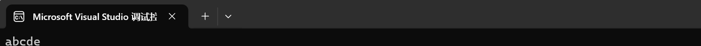
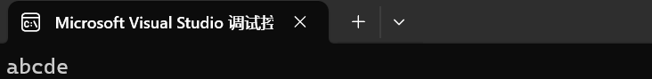
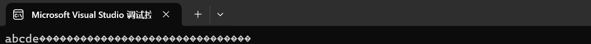
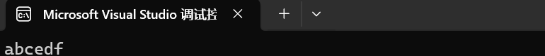
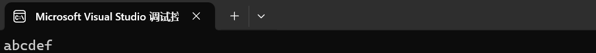

# 字符串

## 字符串的定义

什么是字符串？

> 字符串就是有多个字符组成的序列

* 简单点，就是一句话（可以是中文的，也可以是英文的）

## 字符串的定义

> 在C语言中，没有独立的字符串的类型,而是使用 **字符数组和字符指针**进行定义和处理

> C语言规定: 字符串以'\0'为结尾

* 接下来，我们就分别尝试这两种方式来定义**字符串**

* 不过在此之前，还是先声明一下字符串打印(输出)和输入的方式

> 输出样例: printf("%s",字符串)；

* s-string的缩写
* 同时，打印字符串从首元素开始，一直到“\0”为止

> 输入样例: scanf("%s",字符串)

* 由于字符串的标识符本身是首元素的地址，因此不需要&

### 通过字符数组定义字符串

* 使用一维字符数组的定义时，有以下几种情况：
* 1. 字符形式定义

~~~c
#include<stdio.h>
int main()
{
	char a[6] = { 'a','b','c','d','e','\0' };
	printf("%s", a);
	return 0;
}
~~~

改动1：如果’\0‘，不写呢？

~~~c
#include<stdio.h>
int main()
{
	char a[6] = { 'a','b','c','d','e' };
	printf("%s", a);
	return 0;
}
~~~

依旧是成立的，这是为什么？

> 不完全初始化的字符数组，系统自动补’\0‘,其结果等价与字符串

如果进一步进行改动呢？把[]中的数字删除呢？

~~~c
#include<stdio.h>
int main()
{
	char a[] = { 'a','b','c','d','e' };
	printf("%s", a);
	return 0;
}
~~~

* 明显是字符数组越界了，printf一致无法检索到'\0'，就一直打印
* 因此，不定义字符数组长度时，要想实现字符串，一定要'\0'

* 2. 用字符串常量进行定义

~~~c
#include<stdio.h>
int main()
{
	char a[] = { "abcedf" };
    printf("%s", a);
	return 0;
}
~~~

* “” 声明了这是字符串，因此不需要’\0‘
* 同时，由于""对字符串的范围进行了界定，因此也可以直接 char a[]=“abcedf”; ——省略花括号
* 当然，如果你给数组的长度进行了界定，但是初始化时的大小超过了初定值，那么字符串就会无法正常打印，究其原因是缺少'\0'

> 一维字符串的推荐定义方式:
>
> 1. char ch[]="       ";
> 2. char ch[x]={'' ,' ','','','','','',''};x尽量大，大于后面的长度

* 使用上述的方式对二维字符数组进行定义和初始化
* 二维字符串的定义方式类似，因此只谈注意事项

> 二维字符串的推荐定义:
>
> 1. char a\[][COL]={" "," " ," " , " "};COL必须写而且必须要比后面的大
> 2. char a\[][COL]={{''....''\0'},{''....''\0'},{''....''\0'},....,{''....''\0'}};COL必须写而且必须要比后面的大

> 最推荐使用字符串常量定义字符串

* 注: 字符数组也可以打印，但是不能采用'\0'拦截的方式打印，只能通过循环的方式打印
* 输入首元素的地址，%s的打印方式只属于字符串

### 通过字符指针定义字符串

* 我们知道数组名本质是指针
* 因此，我们可以创建一个字符指针，指向常量字符串，来定义字符串变量

~~~c
#include<stdio.h>
int main()
{
	char* pa = "abcdef";
	printf("%s", pa);
	return 0;
}
~~~

* 原理： 
* 在内存的常量区，创建字符串常量"abcdef"
* 创建一个字符指针，指向上述的字符串

>  字符定义字符串的方式:
>
> char* 标识符 =“   ”；

* 通过数组的学习，我们知道:数组名是指针常量；指针和数组的某些操作类似

* 上一道例题感受一下吧

### 例题

* 输入一段文字（不带空格），统计其中的字母和其他字符各有多少？

~~~c

#include<stdio.h>
void count(char* p, int* num, int* zimu, int* ote)
{
	while ((*p) != '\0')
	{
		if ((*p >= 'a' && *p <= 'z') || (*p >= 'A' && *p <= 'Z'))
		{
			(*zimu)++;
		}
		else if (*p >= '0' && *p <= '9')
		{
			(*num)++;
		}
		else
		{
			(*ote)++;
		}
		p++;
	}
}
int main()
{
	char* p = "input string";
	printf("%s\n", p);
	char arr[30] = { '\0' };
	scanf("%s", arr);
	p = arr;
	int num = 0, zimu = 0, ote = 0;
	count(p, &num, &zimu, &ote);
	printf("%d\n%d\n%d\n", zimu, num, ote);
	return 0;
}
~~~

## 字符串的常见操作

字符串的输入输出除了printf|scanf，还有其他的吗？

> 输入函数:printf puts
>
> 输入函数:scanf gets

* 本小节将着重讲述这两个函数
* 