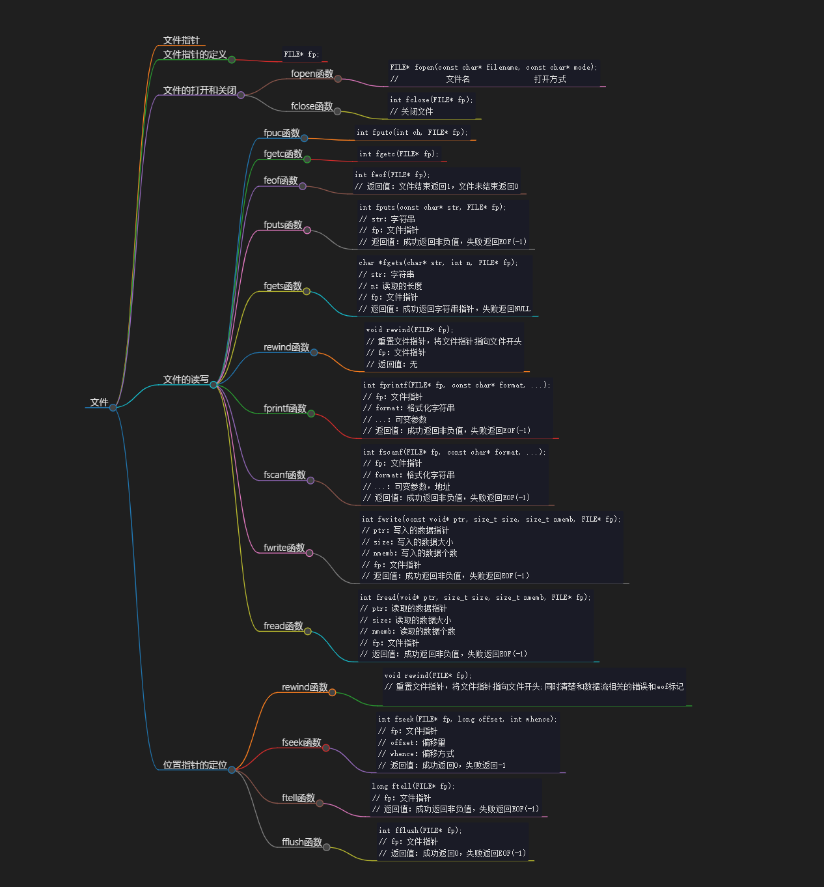

# 文件

> 核心问题：磁盘和程序进行交互

## 文件指针

文件： 文本文件(字符序列)和二进制文件(字节序列)

文件指针：系统预先定义的

## 文件指针的定义

~~~c
FILE* fp;
~~~

## 文件的打开和关闭

### fopen函数
~~~c
FILE* fopen(const char* filename, const char* mode);
//            文件名                打开方式
~~~
> 表示文件地址时，一定要使用双斜杠！！！//避免转义字符的问题，使用的是纯'\'
> 一定要对函数进行检查
> 第一个参数也可以是字符串常量、文件名的指针、一维数组名

> 文件打开方式
> r：只读，文件不存在则报错，位置指针指向首字节
> w：只写，文件不存在则创建，存在则清空，位置指针指向首字节
> a：追加，文件不存在则创建，存在则追加，位置指针指向尾部
> b：二进制文件，默认为文本文件，文本文件默认为ASCII编码，二进制文件默认为二进制编码
> +：追加，文件不存在则报错

> r+：读写，文件不存在则报错
> w+：读写，文件不存在则创建，存在则清空
> a+：读写，文件不存在则创建，存在则追加

>> fopen函数返回值是文件指针，但是文件的结构体内部有位置指针
### fclose函数
~~~c
int fclose(FILE* fp);
// 关闭文件
~~~
>  返回值：成功返回0，失败返回EOF(-1)
>但是我们经常忽略它的返回值

## 文件的读写
### fpuc函数
> 写入某个字符
~~~c
int fputc(int ch, FILE* fp);
~~~

### fgetc函数
> 读取某个字符
~~~C
int fgetc(FILE* fp);
~~~
> 读取某个位置的指针，并且移动指针——读取+移动
> 写入内容后，不能直接进行读取内容
> 写入内容后，指针会自动移动到末尾，所以读取时，指针会自动移动到末尾，导致读取不到内容

### feof函数
> 判断文件是否结束
~~~c
int feof(FILE* fp);
// 返回值：文件结束返回1，文件未结束返回0
~~~
> 循环判断之前要要先读取一个字符，再判断是否结束

### fputs函数
> 写入字符串
~~~c
int fputs(const char* str, FILE* fp);
// str：字符串
// fp：文件指针
// 返回值：成功返回非负值，失败返回EOF(-1)
~~~
> 与fputc类似

### fgets函数
> 读取字符串
~~~c
char *fgets(char* str, int n, FILE* fp);
// str：字符串
// n：读取的长度
// fp：文件指针
// 返回值：成功返回字符串指针，失败返回NULL
~~~
> 但是这不意味着会被显示到

### rewind函数
> 重置文件指针
~~~c
void rewind(FILE* fp);
// 重置文件指针，将文件指针指向文件开头
// fp：文件指针
// 返回值：无
~~~

> fgets函数后是否接入fgets("\n",pf);,对行数的影响；没有向文件中写入换行符的操作；
> puts 函数会有向输出设备写入换行符的操作；

### fprintf函数
> 格式化输出，将内容输出到文件
~~~c
int fprintf(FILE* fp, const char* format, ...);
// fp：文件指针
// format：格式化字符串
// ...：可变参数
// 返回值：成功返回非负值，失败返回EOF(-1)
~~~
> printf就是fprintf的简化版，stdout就是FILE* fp的一种，就是默认的显示器的文件指针

### fscanf函数
> 格式化输入，从文件中读取内容
~~~c
int fscanf(FILE* fp, const char* format, ...);
// fp：文件指针
// format：格式化字符串
// ...：可变参数，地址
// 返回值：成功返回非负值，失败返回EOF(-1)
~~~
> scanf就是fscanf的简化版，stdin就是FILE* fp的一种，就是默认的键盘的文件指针

### fwrite函数
> 写入二进制文件
~~~c
int fwrite(const void* ptr, size_t size, size_t nmemb, FILE* fp);
// ptr：写入的数据指针
// size：写入的数据大小
// nmemb：写入的数据个数
// fp：文件指针
// 返回值：成功返回非负值，失败返回EOF(-1)
~~~
> 数据块就是为了接入更多的数据，设计的

### fread函数
> 读取二进制文件
~~~c
int fread(void* ptr, size_t size, size_t nmemb, FILE* fp);
// ptr：读取的数据指针
// size：读取的数据大小
// nmemb：读取的数据个数
// fp：文件指针
// 返回值：成功返回非负值，失败返回EOF(-1)
~~~

## 位置指针的定位
### rewind函数
~~~c
void rewind(FILE* fp);
// 重置文件指针，将文件指针指向文件开头;同时清楚和数据流相关的错误和eof标记

~~~

### fseek函数
> 定位文件指针
~~~c
int fseek(FILE* fp, long offset, int whence);
// fp：文件指针
// offset：偏移量
// whence：偏移方式
// 返回值：成功返回0，失败返回-1
~~~
> 如果是0或者SEEK_SET，则偏移量是相对于文件开头的位置
> 如果是1或者SEEK_CUR，则偏移量是相对于当前位置
> 如果是2或者SEEK_END，则偏移量是相对于文件结尾的位置
> offest必须是长整型

### ftell函数
> 获取文件指针的位置，相当于头指针的偏移量
~~~c
long ftell(FILE* fp);
// fp：文件指针
// 返回值：成功返回非负值，失败返回EOF(-1)
~~~

### fflush函数
> 刷新缓冲区
~~~c
int fflush(FILE* fp);
// fp：文件指针
// 返回值：成功返回0，失败返回EOF(-1)
~~~

