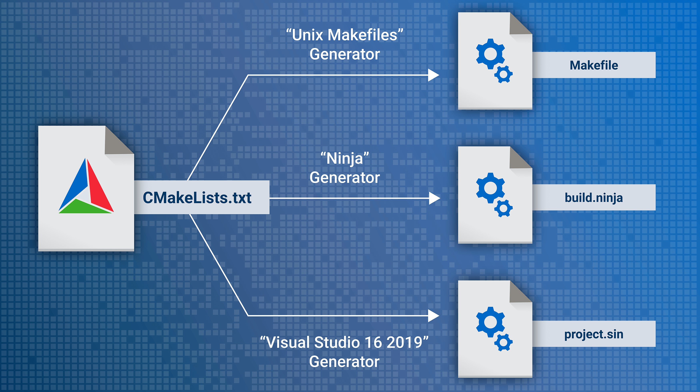

#

# CMake

> 自动化构建系统---管理软件建置的程序,并不依赖于特定的编译器,支持多层目录,多个应用程序和多个函数库

​								CMake

CMakeLists.txt-------->构建文件(Makefile Ninja构建文件 VisualStudio工程文件)



## 基础

### 指定Cmake的最低版本要求: cmake_minimun_required(VERSION 3.10)

### 定义项目的名称和使用的编译语言: project(项目名字 编程语言....) 

### 指定要生成的可执行文件和其源文件: add_executable(可执行文件 源文件,源文件...)

### 创建一个库及其源文件: add_library(库文件 源文件....)

### 链接目标文件与其他库: target_link_libraries(可执行文件 库文件...)

### 添加同文件搜索路径: include_directories(  ??)

### 设置变量的值: set(变量 值)

### 设置目标属性: target_include_directories(可执行文件 属性 路径)

## 例题

```cmake
cmake_mininum_required(VERSION 3.10)
project(目标名)
add_executable(目标名 依赖项)
```

cmake .---执行当前目录下的cmake

> 小tips:
>
> 创建一个build文件夹——装载一切cmake的副产物