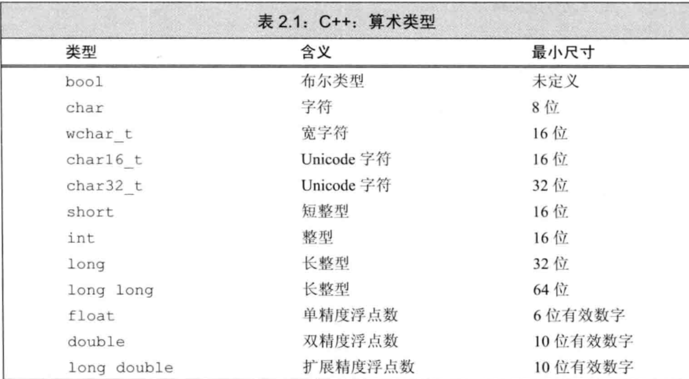
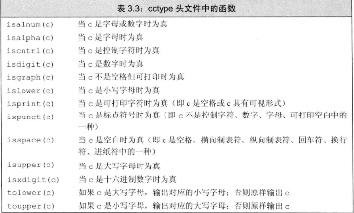
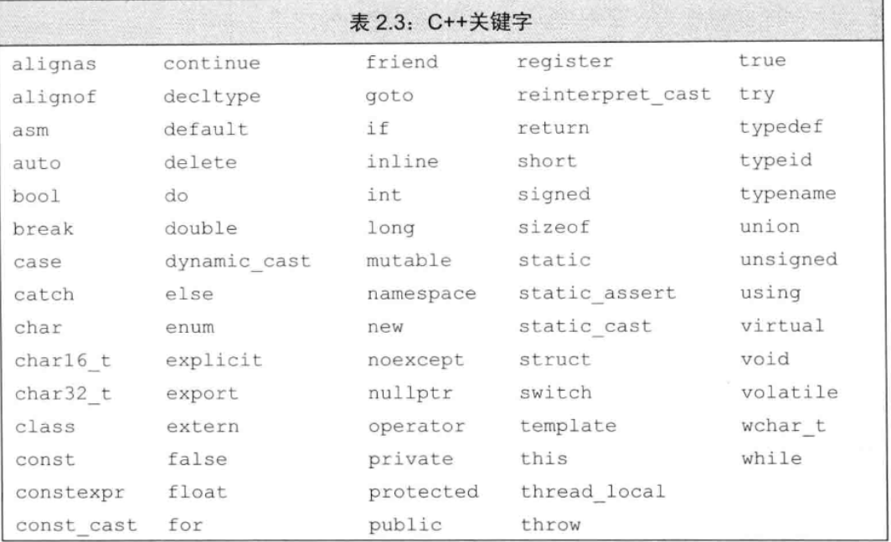
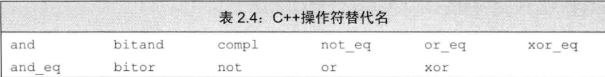

# C++11
by Ttzs
> 类型决定操作

## 头文件
> 头文件通常包含只能定义一次的实体
> 继承的C语言的标准库的头文件,在c++中以c开头,去掉.h,加上c;并且定义的名字从属于命名空间std;name.h和cname在c++中都是有效的
### 编写建议
#### 1. 头文件中不应该包含using声明
#### 2. 使用cname库

## 命名空间
### 范式:using namespace::name;
### 范式:using namespace std;
### 编写建议:
#### 1. 头文件不应该包含using声明

## 预处理命令
### 包含头文件
#### 范式:#include<标准头文件>
#### 范式:#include"自定义头文件"
### 头文件保护符
> 依赖于预处理变量
#### 设置预处理变量范式:#define 变量
#### 检验未定义变量范式:#ifndef 变量....#endif
#### 检验已定义变量范式:#ifdef 变量....#endif
#### 包含头文件的常用范式 #ifndef 变量  <\/n> #define 变量  <\/n>xxxx <\/n>#endif
> 预处理变量无视作用域的规则
### 编写建议
#### 1. 预处理变量全部大写
#### 2. 习惯使用头文件你保护符的常用范式

## 基本类型
### C++:算术类型 
### 算术类型
### 字面值常量
### 空类型

## 复合类型
### 引用(左值引用;引用将它和它的初始值对象绑定在一起)
#### 范式:Type &变量名=xxx;(声明必须初始化)
> 引用并非对象,只是为一个已经存在的对象所起的别名,且无法定义引用的引用
> 引用只能绑定一次且必须初始化
> 引用的类型要和与之绑定的对象严格匹配
> 除了两个例外,引用只能绑定在对象上,而不能与字面值或某个表达式的计算结果绑定在一起
#### 常量引用(对const的引用)
##### 范式:const type &标识符 = 任意变量|字面值常量
> 非const的引用 无法引用 const类型的变量
> const的引用时允许用任意表达式作为初始值,只要该表达式的结果能转化成引用的类型(临时量机制)
> 非const的引用 是对变量的直接引用;const的引用的是临时量
### 指针
#### 定义范式:Type *变量;
#### 初始化范式:Type *变量 = & 变量;
> 不能定义指向引用的指针
> 除了两个例外,指针的类型都要和它所指向的对象严格匹配
#### 指针值:指向一个对象;指向紧邻对象所占空间的下一个空间;空指针,意味着指针没有指向任何对象;无效指针(野指针)
#### 解引用范式:*指针(解引用)
> 解引用操作适用于指向某个对象的有效对象
#### 空指针:nullptr(C++11);0;NULL(预处理变量;cstdlib)
> 不能将值为0的变量赋给指针
#### 常见指针操作:1. 指针;2. 逻辑判断(指针合法性判断;指针相等);
> 指针相等的情况:1. 空指针;2. 指向同一个对象;3. 指向了同一个对象的下一个地址;4. 有时,一个指针指向一个对象,另一个指向另外对象的下一个地址
#### void*指针(存放任意对象的地址;但不清楚时什么类型的对象)
##### 操作: 1. 比较;2. 函数的输入输出;3. 赋给另一个void*指针;
> 不能对void\*解引用,不能直接操作void\*指针所指的对象
#### 指向指针的指针(二级指针..): **(*..)标识符
#### 指向指针的引用: Type *&r=标识符;
> 不存在指向引用的指针
> 从右向左阅读,离变量名最近的符号对变量的类型由最直接的影响
#### 指向常量的指针
##### 范式:const Type *标识符 = &任意变量
> const 修饰的变量只能由const修饰的指针指向
> const 修饰的指针可以指向任意非const修饰的变量,无法通过指针修改值,但是可以通过其他方式
##### const指针
###### 范式:Type * const 标识符 = &任意变量
###### 范式:const Type * const 标识符 = &任意常量;constexpr const Type * 标识符=&任何变量(指向常量的常量指针)
##### 顶层const和底层const
###### 顶层const:指针本身是个常量;
###### 底层const:指针所指向的对象是个常量;
> 容易混淆的是 const+非指针类型 和 const+指针类型
### 数组

## 标准库类型
### string
> 可变长的字符序列。严格讲,string不是容器
> 使用必须包含头文件<\string>
#### 类型
##### string 类型
> **字符串字面值不是string对象,类型不同**
##### string::size_type 类型
> size_type是一个无符号类型,用于存放任何string对象的大小
> 要注意无符号整形和整形负数的比较,负数会自动转化成无符号整形
#### 初始化范式
##### 1.string 声明符列表;(默认初始化;空字符串)
##### 2.string 声明符 = 另一个声明符;(拷贝初始化)
##### 3.string 声明符 = "内容";(直接初始化)
##### 4.string 声明符列表(内容|另一个声明符);
##### 5.string 声明符(n,'字符');(n个字符重复形成的字符串)
##### 6.string 声明符 = string(n,'字符');(不推荐)
#### 操作(函数名调用,重载运算符)
##### 1.读写操作
###### I.读入操作:is>>string;getline(is,string);
###### 常用操作:cin>>string;getline(cin,string);
> 读入操作会忽略空白字符(空格,换行符,制表符),直到下次空白字符出现
> getline()函数保留空白符,直到换行符(换行符也被读进来),然后将内容存到string对象中(不存换行符)，返回流参数;换行符只是标志,并不会被拷贝
###### II.写出操作:os<<\string<<\endl;
###### 常用操作:cout<<\string<<\endl;
##### 2.empty()和size()操作
###### I.string.enpty():判断字符串是否为空
###### II.string.size():返回字符串的长度;返回值类型是string::size_type
##### 3.比较操作(==,!=,>,<,>=,<=)
> 比较原则:字典顺序(长度和每个字符的ASCII)
##### 4.赋值操作(=)
##### 5.连接操作(+,+=)
> 字符字面值和字符串字面值都可以通过**赋值或者连接操作**准化成string对象
> string对象和字符字面值及字符串字面值的连接操作,必须保证**运算符两侧至少一个**是string对象。
> 由于运算从左向右进行,因此允许"s+" "+ " "...."
##### 6.范围语句(C++11)
###### I.范围for语句:for(声明符:表达式)
> for(auto 变量: string)
> for(auto &变量: string)--->引用;可以修改字符
##### 7.访问
###### I.下标范式: string[\索引]
> 输入参数是string::size_type类型
> 如果是带符号的值,会自动转化成无符号整形
> 越界访问和访问空串的行为是未定义的
> 附:对于字符的函数(使用<\cctype>)
###### II.迭代器范式;
##### 8.调整字符串
###### 调整范式:string.resize(n,'char')
> n：size_type类型;char:字符
> 如果string的长度小于n,则在string的末尾添加n-string.size()个默认字符('char'或者'\0');如果string的长度大于n,则删除string.size()-n个字符
### vector模板(向量)
> 相同类型的对象的集合,因此不存在包含引用的vector
> 使用必须包含头文件<\vector>
> vector是一个类模板,某个类型的容器
> 模板:为编译器生成类或函数编写的一份说明
> 实例化:编译器根据模板创建类或函数的过程
> vector<\vector<\类型>>(c++11)
> 可以动态地增长
#### 1.定义和初始化
##### a.默认初始化
###### 范式:vector<\类型> 标识符;(空vector)
##### b.拷贝初始化
###### 范式:vector<\类型> 标识符(另一个vector);
###### 范式:vector<\类型> 标识符=另一个vector;
> 拷贝初始化的类型要一致
##### c.列表初始化
###### 范式:vector<\类型> 标识符{a,b,c...};
###### 范式:vector<\类型> 标识符={a,b,c...};
> 初始化多元素只能采用列表初始化
##### d.构造对象
###### 范式:vector<\类型> 标识符(n,值);(n个重复的值)(构造对象)
###### 范式:vector<\类型> 标识符(n);(n个默认初始化的值;值默认初始化)(构造对象)
> 限制:有些值要求必须明确地提供初始值;
> 不能使用字符串字面值构造vector<\stirng>
###### 范式:vector<\类型> 标识符={n,值};(n个重复的值)(类型不能和n一致)
#### 2.操作
##### a.添加元素
###### 范式:vector.push_back(值);
> 要求:确保所写的循环正确无误,特别是有可能改变vector对象的容量时候
> 范围for语句体内不应改变其所遍历序列的大小
##### b.empty()和size()
###### I.范式:vector.empty();(判断是否为空)
###### II.范式:vector.size();(返回vector的大小)
> 返回值是:vector<\类型>::size_type
##### c.访问元素
###### I.范式:vector[\索引];
> 不能像python一样通过索引添加元素;仅能通过索引访问已经存在的元素
###### II.范式:for(auto &变量: vector);(引用;可修改)
###### III.范式:for(auto 变量: vector);(不可修改;只读)
###### IV.使用迭代器范式
##### d.拷贝替换
###### 范式:vector=另一个vector;
###### 范式:vector={a,b,c...};
##### e.逻辑判断(==,!=,>,<,>=,<=)(比较的前提是同类型;字典顺序比较)
#### 两个限制
##### 1. 不能在范围for语句中添加元素(遍历vector时不要添加)
##### 2. 任何一种可能改变vector对象的容量的操作都可能使指向vector对象的迭代器失效
### 迭代器(指向容器中的元素)
> 所有的容器和string都支持迭代器
> 迭代器有有效和无效之分
#### 类型:
##### 迭代器类型:vector<\类型>::iterator
> iterator:迭代器类型
##### const迭代器类型:vector<\类型>::const_iterator
> const_iterator:常量迭代器类型,只能进行读取操作
#### 成员函数:
##### 容器.begin()(指向第一个元素)
##### 容器.end()(尾后迭代器;指向容器最后一个元素的下一个位置)
##### 容器.cbegin()(指向第一个元素)
##### 容器.cend()(尾后迭代器;指向容器最后一个元素的下一个位置)
> cbegin()和cend():cbegin()返回的是const_iterator类型的迭代器
> 空容器<===>容器.begin()==容器.end()
#### 运算符:
##### 1.解引用运算符(*)范式: *iter;
##### 2.箭头运算符(->)范式: iter->成员函数;(*item.成员函数)
##### 3.递增运算符(++)范式: ++iter;(下一个元素)
##### 4.递减运算符(--)范式: --iter;
##### 5.逻辑运算符(==,!=)范式(同一个元素则是相等)
#### string和vector支持的运算
###### iter + n:返回迭代器向前移动n个位置的迭代器
###### iter - n:返回迭代器向后移动n个位置的迭代器
###### >,>=,<,<=:比较两个迭代器的位置关系
###### iter1 - iter2:返回两个迭代器之间的距离
> 返回值类型:vector<\类型>::difference_type(带符号整形数)
###### 复合运算符:+= -=
### 编写建议
#### 1. 访问序列前,检查字符串是否为空或者索引是否越界
> 推荐使用,string::size_type类型的索引,因此只需要检查是否小于size()
> 尽可能使用范围for语句
#### 2. for语句推荐使用!=和迭代器而不是<,因为!=适用于所有迭代器类型
#### 3.不要向已经使用迭代器的容器中添加元素

## 自定义数据结构
### 结构体
#### 范式:struct 类型名 {};
#### 范式:struct 类型名 {}声明符列表;
#### 类内初始值(C++11): 类内初始值用于初始化数据成员;没有初始值的成员将被默认初始化
> 只能放在花括号内,或者放在等号右边,不能使用花括号
#### 访问成员变量:变量.数据成员
### 类
#### 范式:class
### 编写建议
#### 1. 一般情况,类定义在头文件中，而且头文件的名字应该和类名保持一致

## 类型处理
### 类型别名
#### 范式: typedef 类型 别名;typedef 类型 *p(指针类型的别名)
> const 指针别名 = 指向Type的常量指针;简单替换去理解是错误的,基本数据类型的改变
### 别名声明(C++11)
#### 范式: using 别名 = 类型
### auto类型说明符 (c++11)
#### 使用范式:auto 声明符列表 = 内容;
> 编译器通过初始值猜测
> 保留底层const,忽略顶层const
> 顶层const:const auto 声明符列表 = 内容;
> 设置一个auto的引用,初始值中的顶层常量属性依然保留;但是,不适用auto时,给一个初始值绑定一个引用,此时的常量就不是顶层常量
### decltype类型说明符(c++11)
#### 范式: decltype (表达式|变量) 声明符列表= 内容;
> decltype(变量) 返回全部类型--->包括顶层const和引用
> 如果想要得到引用的对象的类型,需要进行运算;
> decltype ((变量))---表达式;变量是一种可以作为赋值语句左值的特殊表达式
> decltype获得引用的情况:1.((变量));2.*指针;3.引用

## 变量(一块能储存数据并具有某种类型的内存空间)
### 声明(规定:变量的类型和名字;分离式编译机制)
#### 范式1: 基础数据类型 变量名列表;
#### 范式2: extern 基础数据类型 变量名列表;(拓展定义域)
> 在函数体内部,如果试图将初始化一个由exteren 关键字标记的变量,将引发错误
#### 复合类型声明的范式3: 基础数据类型 声明符列表(声明符命名一个变量和与基础数据类型有关的某种类型)
> 类型修饰符时声明符的一部分
### 定义: 
#### 1. 范式: 基本数据类型 \[类型说明符\ 标识符\](变量名以逗号分隔,分号结束)
#### 2. 标识符的规则:
##### I.下划线,字母,数字(前两者可以作为开头);
##### II. 关键字和操作符替代名无法作为标识符;
##### III. 不能出现连续两个下划线,不能以下划线紧连接大写字母开头
##### IV. 定义在函数体外的标识符不能以下划线开头
##### V.其他规范: 体现实际意义;变量名全部小写;用户自定义类名大写字母开头;多个单词间要有明显区分,使用\'\_\'
#### 3. 作用域(解决相同名字的变量发挥作用的问题)
##### O.作用域大多数作用域以花括号分隔;
##### I.全局作用域:定义于所有函数体之外的名字
##### II.块作用域
##### III.嵌套作用域:外层作用域 && 内层作用域
> 内层可以访问外部定义的,内层可以重新定义外层已有的名字----与C语言一样
#### 4. const限定符
##### I.范式: const Type 声明符=内容;
##### II.操作:初始化
> const 和 非const类型的操作的区别是: const对象上执行不改变其内容的操作
##### III.文件和const: 默认状态时,const 对象仅在文件内有效;多文件共享,定义和声明前都将上extern
##### IV.顶层const和底层const
###### 顶层const:一般地,任意的对象是常量
###### 底层const:一般地,与指针和引用等复合类型的基本类型部分有关
###### 拷贝操作:顶层const不受影响;底层const的限制不能忽视,拷贝对象双方必须拥有相同的底层const资格(或者两个对象的数据类型必须能够转换)
> 类型转换:非常量转化为常量
##### V.常量表达式(常量表达式:值不会改变并且在编译过程中就能得到计算结果的表达式)
###### 字面值;用常量表达式初始化的const对象
##### VI.constexpr类型(C++11)
###### 声明范式:constexpr type 标识符;
###### 定义范式:constexpr type 标识符=xxx;
> 将变量声明constexpr类型,便由编译器来验证变量的值是否是一个常量表达式;
##### VII.字面值类型
> 算术类型,引用和指针都属于字面值类型;其中指针必须是nullptr或0,或者存储于某个固定地址中的对象
> > constexpr指针只能指向所有函数体之外的对象(地址固定不变)和staic修饰的变量
> > constexpr声明中如果定义了一个指针,限定符仅对指针有效,和指向的对象无关
> 自定义类,IO库,string等不属于字面值类型
### 初始化:(使用"字面值常量,变量,函数"进行对变量的初始化)
#### 1. 直接初始化
##### 范式1:基础数据类型 变量 = x
##### 范式2:基础数据类型 变量(x)
#### 2. 列表初始化(x为字面值常量)
##### 范式1:基础数据类型 变量 = {x}
##### 范式2:基础数据类型 变量{x}
> 当列表初始化并且初始值存在丢失风险(类型转换的时候),编译器将会报错---保障数据的有效性
##### 列表初始化的独特
###### 1.拷贝初始化时只提供一个初始值;
###### 2.提供类内初始值时,只能使用拷贝初始化或使用花括号形式的列表初始化;
###### 3.提供的是初始元素值的列表,则只能使用列表初始化,而不能放在花括号中
#### 3. 默认初始化(影响因素:变量的位置和变量的类型)
##### 定义于函数之外的变量(全局变量)被初始化为0
##### 定义于函数体内部的变量的内置类型(局部变量;块变量)将不被初始化,其值未定义
##### 每个类各自决定其初始化对象的方式,是否不经初始化就定义对象也由类自己决定(可以调节)
##### 绝大多数类如果没有显性的初始化,其值由类确定(参数的默认值)
#### 编写建议
##### 1. 建议初始化每一个内置类型的变量
##### 2. 使用变量之前必须声明其类型(编译器将会负责类型检查)
##### 3. 坚持标识符的命名规范
##### 4. 在第一次使用变量时,定义它(便于寻找和初始化)
##### 5. 如果函数有可能使用某全局变量,则不宜再定义一个同名的局部变量
##### 6. 尽量定义时初始化所有指针;定义对象之后再定义指向它的指针;或者初始化为nullptr或0
##### 7. 选择修饰符和变量标识符和空格的一种关系,我选择修饰符紧跟变量标识符
##### 8. 如果认定一个常量表达式,就把它声明为constexpr

## 常见技术
### 预处理器:
> 运行于编译前的一段程序;
> 预处理变量不属于命名空间std,由预处理器负责管理;将预处理变量自动替换为实际值;
> 确保头文件多次包含仍能安全工作
### 编译器:
### 临时量机制: 编译器需要一个空间暂时存储表达式的求职结果时临时创建的一个未命名的对象

## 经典练习题
### 0.经典算法
#### 1. 二分搜索
### 1. 单链处理去除某个字符

## 备注
### 1. C++关键字: 
### 2. C++操作符替代名: