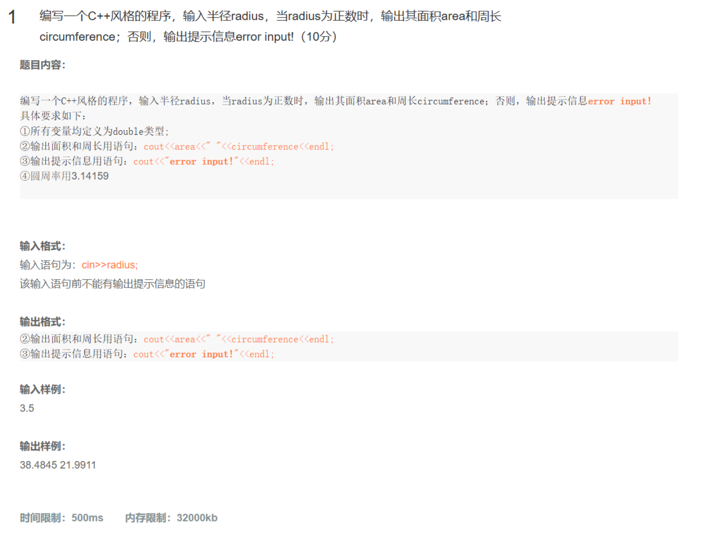

# 面向对象程序设计及C++MOOC练习

> 适用对象: 参加南京邮电大学的C++课程的学生

> 声明: 本指南仅用于参考,以及追求更好的编程经验。如果涉及抄袭等问题，按照校规后果自负。

## 例1:I/O流



```c++
#include<iostream>
using namespace std;

int main()
{
    double radius;
    const double pi =3.14159; 
    cin>>radius;
    if(redius<=0)
    {
        cout<<"error input!"<<endl;
    }
    else
    {
        double circumference = 2*pi*radius;
        double area = pi*radius*radius;
        cout<<area<<" "<<circumference<<endl;
    }
    return 0;
}
```

> Q:我们是否还能再进一步改进？
>
> A(deepseek-R1):
>
> ```c++
> #include<iostream>
> using namespace std;
> 
> int main() {
>     double radius;
>     const double pi = 3.14159;
>     cin >> radius;
> 
>     if (radius > 0) {
>         double area = pi * radius * radius;
>         double circumference = 2 * pi * radius;
>         cout << area << " " << circumference << endl;
>     } else {
>         cout << "error input!" << endl;
>     }
> 
>     return 0;
> }
> ```
>
> 

## 例二:动态内存管理


```c++
#include<iostream>
using namespace std;

//求整数的平均值和负数的个数
int main()
{
    int n =0;
    cin>>n;
    int *p = new int[n];//生成指定数量的动态数组
    double ave = 0,sum=0;
    int pos=0,number=0;
    for(int i=0;i!=n;++i)
    {
        cin>>p[i];
        if(p[i]>0)
        {
            ++pos;
            sum+=p[i];
        }
        if(p[i]<0)
        {
            ++number;            //统计负数的个数
        }
    }
    if(!pos)
    {
        ave =0;
    }
    else
    {
        ave=sum/pos;
    }
    cout << "ave=" <<ave<<"  number="<<number<<endl;
    delete []p;
    return 0;
}
```
>补充的测试样例:
>
>输入:0;返回:ave=0,  number=0

> Q:我们是否还能再进一步改进？
>
> A(qwen):
>
> ```c++
> #include <iostream>
> using namespace std;
> 
> // 函数声明
> void readArray(int* arr, int n);
> double calculatePositiveAverage(const int* arr, int n, int& positiveCount);
> int countNegatives(const int* arr, int n);
> 
> int main() {
>     int n;
>     cout << "请输入数组元素个数: ";
>     cin >> n;
> 
>     // 动态分配数组
>     int* p = new int[n];
> 
>     // 输入数组元素
>     readArray(p, n);
> 
>     // 计算正数平均值和统计负数个数
>     int positiveCount = 0;
>     double ave = calculatePositiveAverage(p, n, positiveCount);
>     int number = countNegatives(p, n);
> 
>     // 输出结果
>     cout << "ave=" << ave << "  number=" << number << endl;
> 
>     // 释放动态分配的内存
>     delete[] p;
> 
>     return 0;
> }
> 
> /**
>  * 从标准输入读取数组元素
>  */
> void readArray(int* arr, int n) {
>     for (int i = 0; i < n; ++i) {
>         cout << "请输入第" << i + 1 << "个元素: ";
>         cin >> arr[i];
>     }
> }
> 
> /**
>  * 计算正数的平均值，并通过引用返回正数的数量
>  */
> double calculatePositiveAverage(const int* arr, int n, int& positiveCount) {
>     positiveCount = 0;
>     double sum = 0.0;
>     for (int i = 0; i < n; ++i) {
>         if (arr[i] > 0) {
>             sum += arr[i];
>             ++positiveCount;
>         }
>     }
>     if (positiveCount == 0) {
>         return 0.0;
>     } else {
>         return sum / positiveCount;
>     }
> }
> 
> /**
>  * 统计负数的个数
>  */
> int countNegatives(const int* arr, int n) {
>     int count = 0;
>     for (int i = 0; i < n; ++i) {
>         if (arr[i] < 0) {
>             ++count;
>         }
>     }
>     return count;
> }
> ```