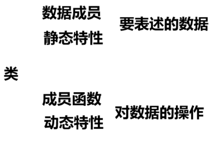
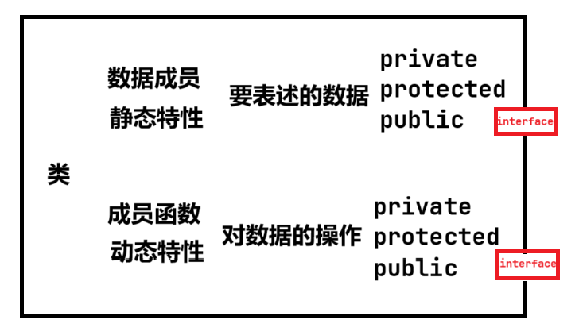
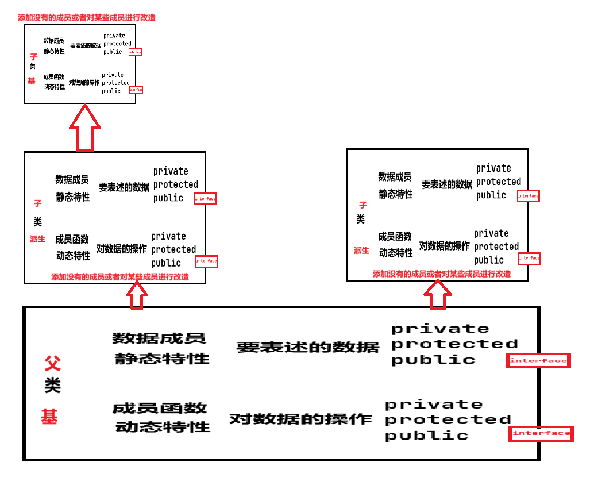
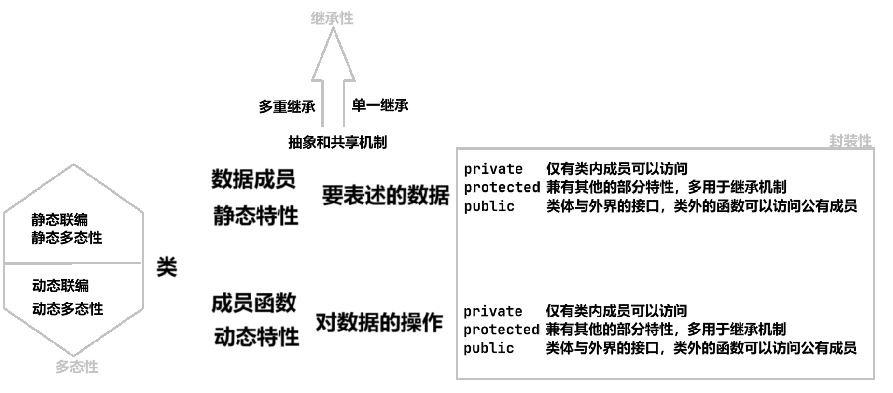
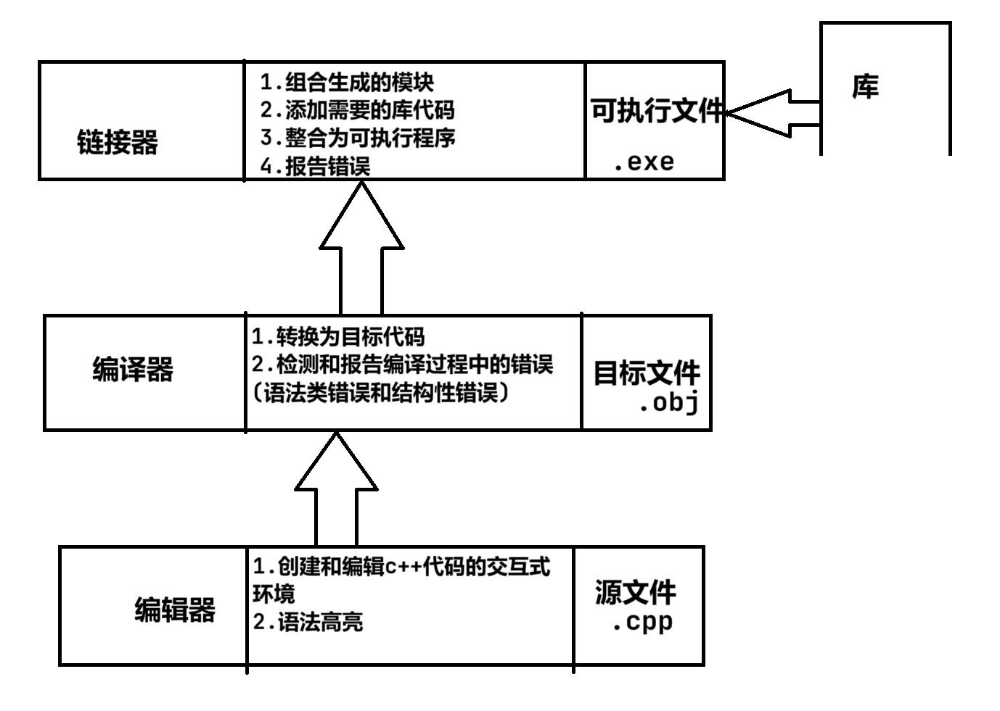

# 面向对象程序设计及C++语言概述

## 对比

|对比项| 面向对象程序设计(OOP) | 面向过程程序设计 |
| ---|------------- | ---------------- |
| 程序基本单元 | 对象 | 函数 |
| 特点 | 将数据和对数据的操作统一为一个整体;数据是隐藏的;数据为中心，将数据与数据上的操作捆绑的思想 | 功能为基础与中心,数据和对数据的操作分离 |
| 核心| 类的设计和类的使用 | 功能分解 |
| 方法| | 自顶而下，逐步求精 |
| 优点 | 可重复，利于维护和扩充；安全和可靠 | 结构清晰,模块化强,直观 |
| 缺点 | | 数据结构对于相关的函数影响较大(代码的可重复性差,不利于维护和扩充) |
| 设计范式| | 程序 = 算法+数据结构 |
| 适用场景 | 大型软件的开发和维护 | 小型的程序和算法设计 |
| 风格 |  | 简练明了                                                     |
|特性|面向对象，面向过程|面向过程|

## 面向对象的程序设计

### 类与对象

> 接口:公有成员函数

> 类与对象的辩证关系:
>
> 1. 对象的类的一个实例，类是对具有相同属性和操作的一组对象的抽象
> 2. 对象是属于类类型的一个变量

> 类与一般类型的区别:
>
> 类具有数据成员和成员函数

> 对象的特征:
>
> 1. 属于某一个类和独特的对象名
> 2. 对象可以有自己的属性值和一组由类规定的操作

### 封装性

> 访问属性:私有属性(private),保护属性(protected),公有属性(public)

### 继承性

### 多态性

> 解释:
>
> 1. 一个行为对应多种不同的实现方法
> 2. 发出同样一条指令，由于接受指令的主题不同，会做出不同的反应
> 3. 使用同一个接口实现不同的操作

## C++语言概述

### C++语言OOP

### C语言和C++语言的关系

1. 继承

   绝大多数的词法和语法直接应用到C++语言中

   C++语言保持:C语言“简洁明了”的编程风格,面型过程的特性

2. 改进

   1. I/O流类库
   2. 名字空间
   3. bool类;string类;允许定义无名联合,无名枚举;扩充结构体
   4. 形式参数可以带有默认值
   5. 函数重载和运算符重载
   6. 引用
   7. 异常检查和处理机制
   8. new和delete运算符

### 开发环境

## QA

1. 编译C++源程序时，出现了警告错（Warning）也可以生成可执行文件。()

> 尝试:cpp中结构性错误g++不会报，可识别语法一般会报错