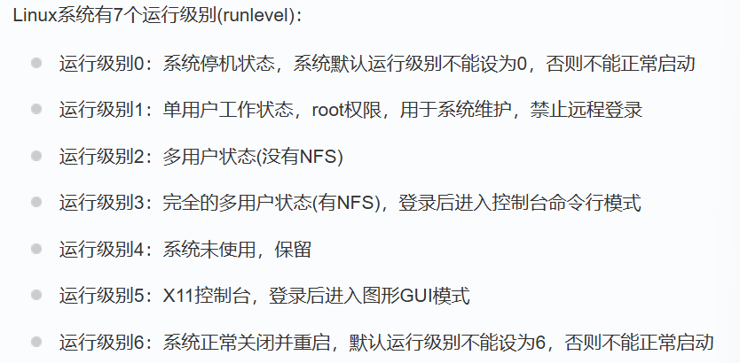

# Linux

## 资源参考

[适合初学者的 Linux 命令行](https://ubuntu.com/tutorials/command-line-for-beginners#1-overview)

## 松散知识点
1. 服务器常用: LAMP(Linux Apache MySQL PHP) LNMP(Linux Nginx MySQL PHP)

## 系统启动过程
操作系统——>/boot(内核引导)——>init进程(所有进程的起点)——>运行级别(运行不同程序)——>系统初始化

## 命令行

1. 展示地址(print working directory)  pwd

2. 切换文件夹(change directory) cd 地址

3. 创建文件夹(make directory) mkdir 文件夹

   特别地,mkdir -p 嵌套文件夹

4. 展示文件夹(list) ls 地址

   特别地,展示所有文件(包括隐藏文件)ls -a

5. 查看文件(concatenate) cat 文件

6. 向文件写入内容(>) 内容 > 文件

7. 向文件追加内容(>>) 内容 >>  文件

8. 分页器阅读 less 文件(使用向上箭头、向下箭头、Page Up、Page Down、Home和End键在文件中移动)

9. 移动(重命名)(move) mv  旧地址 新地址

10. 复制(copy) cp 位置 

11. 删除文件(remove) rm 地址

12. 删除文件夹 rmdir 地址

    特别地,rmdir -r 文件夹(强制删除文件夹)

13. 打印内容 echo 内容

14. 字符计数(word count)wc 地址

    特别地,行计数 wc -l 地址

15. 排序(sort) sort 地址

16. 查看手册(manual) man 指令

17. 超级用户命令 sudo 

> 通配符:
>
> ？ - 表示任何单个字符,包括后缀
>
> \* - 表示零个或多个字符

> 相对地址(相对于当前的目录):
>
>   : 当前目录
>
> xx: 子目录	
>
> .. ：返回上级父目录
>
>  绝对路径:
>
> ~:主目录

> 带有空格的名字: 'name';"name";xx\ x

> 管道字符(|)
>
> 目录计数: ls 地址|wc -l
>
> 罗列文件:ls 地址|less 
>
> 计算唯一行:sort 文件|uniq|wc -l

