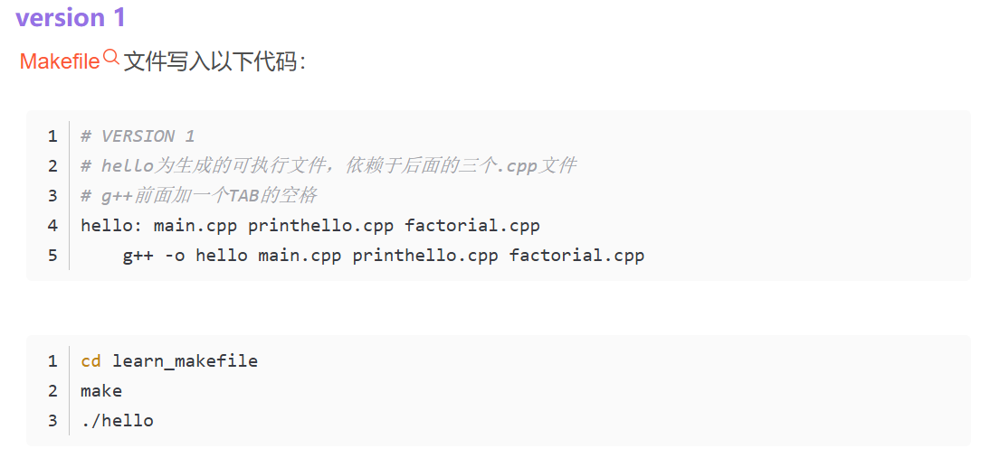
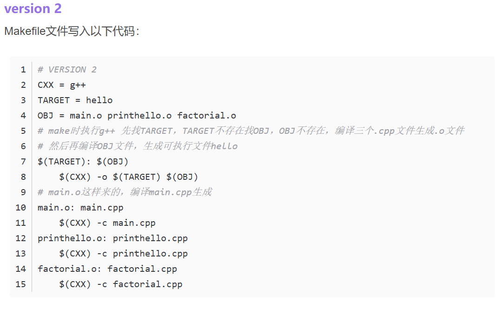
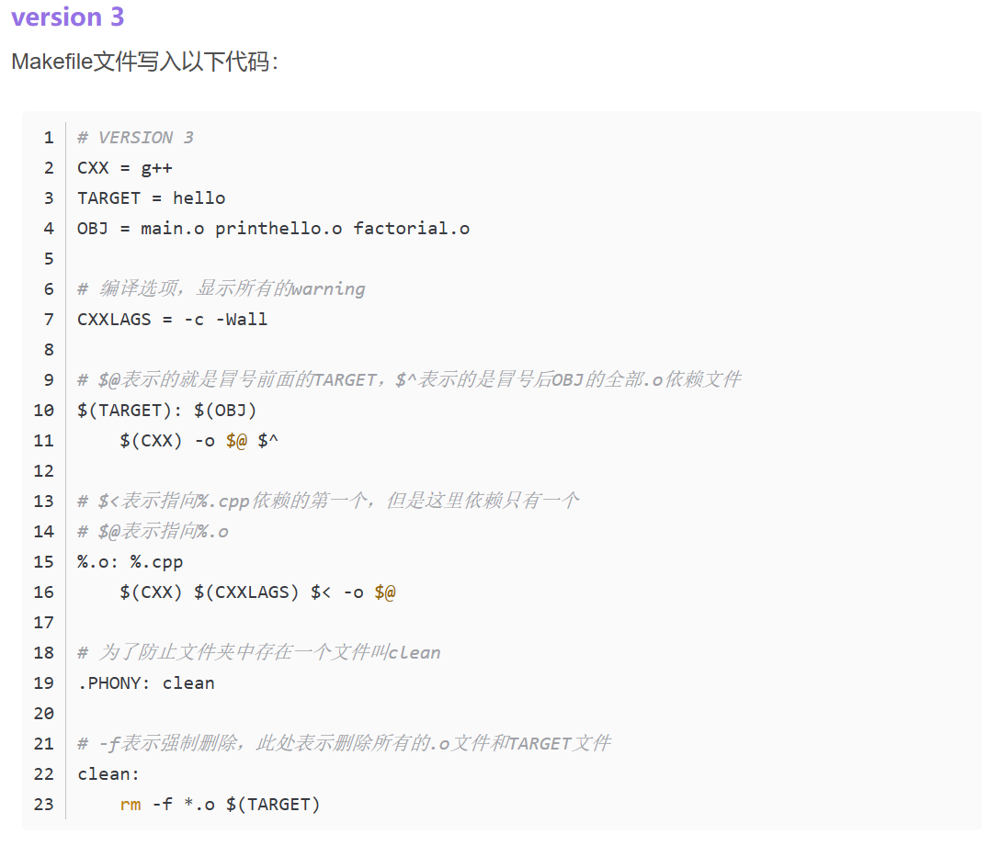
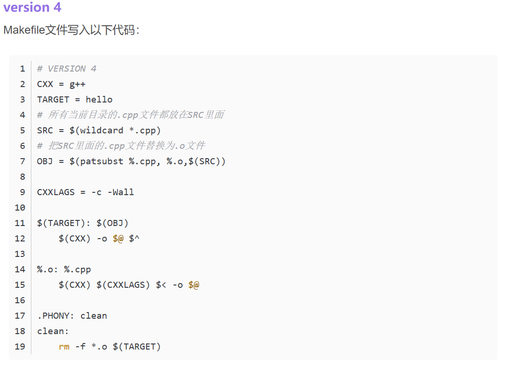

# makefile

1. 注释:  #
2. make   --运行makefile
3. make -f 文件名---寻找指定文件
4. 目标: 依赖项

<Tab>编译器 -o 源文件

5. g++ -o target 依赖项

   \$@ 目标  \$^ 所有依赖项  \$<(第一个依赖项)

   %.o:%.cpp（匹配符）

   .PHONY:clean--->防止clean的歧义

   clean: 

   ​	rm -f（强制）*.o \$(目标)

   $(wildcard *.cpp)-当前路径下的所有cpp文件

   $(patsubst %.cpp,%.o)-替换

 

