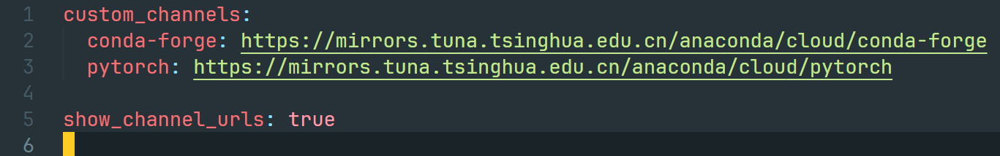

# conda
## 资源
### 1.[anaconda官网](https://www.anaconda.com/)
### 2. [anaconda笔记：conda的各种命令行操作](https://gsy00517.github.io/anaconda20190913231748/)

## 命令
### 配置完新的镜像后清除缓存 conda clean -i
### 恢复默认源 conda config --remove-key channels
### 展示源 conda config --show channels
### 罗列环境 conda env list
### 创建新环境 conda create -n(--name) 环境名 (python=版本号)
### 激活环境 conda activate 环境名
### 安装python conda install python=版本号
### 安装包 conda install 包名
### 更新包 conda update 包名
### 退出环境 conda deactivate
### 删除环境 conda env remove -n 环境名

## 备注
> 1. .condarc

