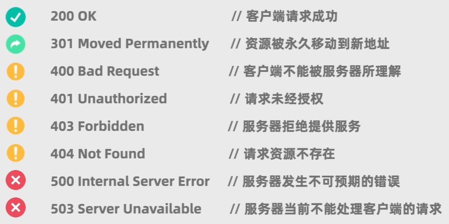

# 爬虫
## 获取网页内容
### HTTP请求
> HTTP -Hypertext Transfer Protocol(超文本传输协议)
1. 请求行
POST 资源路径?查询参数&查询参数 协议版本  
2. 请求头
Host: 域名
User-Agent: 客户端相关信息
Accept: 客户端能接受的数据类型(多类型用,分隔;*/*表示所有类型)
3. 请求体
客户端传给服务器的其他任意数据
#### 请求方法
##### GET:获得数据
##### POST:常见数据
> 请求体一般是空的
### HTTP响应
1. 状态行
协议版本 状态码 状态码描述
2. 响应头
Date: 服务器时间
Content-Type: 响应体数据类型;charset=编码格式
3. 响应体
服务器返回的数据
### Python-Requests库
response=requests.get(url, params=None, headers=None, cookies=None, auth=None, timeout=None):发送GET请求
> url:请求的url地址
> params:请求的查询参数
> headers:请求头
> cookies:请求的cookies
> auth:请求的认证信息
> timeout:请求的超时时间
> 返回值:响应对象
response.text:获取响应体的文本数据
response.content:获取响应体的二进制数据
response.status_code:获取响应状态码
response.headers:获取响应头 
response.cookies:获取响应的cookies
response.url:获取响应的url
response.encoding:获取响应的编码格式
response.json():获取响应的json数据
response.ok:判断响应是否成功

## 解析网页内容
### HTML:定义网页的结构和信息
#### 基本标签
```html
<!DOCTYPE HTML>:声明文档类型
<html>:起始标签
    <head>:主题内容
    </head>
</html>:结束标签
#### 标题标签
<h1></h1>:一级标题
<h2></h2>:二级标题
<h3></h3>:三级标题
<h4></h4>:四级标题
<h5></h5>:五级标题
<h6></h6>:六级标题
> 层级去区分标题标签,而非字号
<title></title>:选项卡标题
#### 文本标签
<p></p>:段落
> 不同p标签之间进行换行,表示不同段落
<br>:换行(只有起始标签)
<b></b>:加粗
<i></i>:斜体
<u></u>:下划线
#### 图片标签
（只有起始标签）
> src:图片路径|指向图片的路径
> alt:图片描述|图片无法显示时的描述
> title:图片标题|鼠标悬停时的标题
> width:图片宽度
> height:图片高度
#### 链接标签
<a href="链接地址" title="链接标题" target="跳转方式">链接文本</a>
> href:链接地址|指向链接的路径
> title:链接标题|鼠标悬停时的标题
> target:跳转方式|_blank:新窗口打开|_self:当前窗口打开
#### 容器标签
<div></div>:块级容器
> 用于包裹其他标签
<span></span>:行内容器
> 用于包裹行内标签
#### 列表标签
<ol></ol>:有序列表
<li></li>:列表项(有序列表中显示序号;无序列表中显示符号)
<ul></ul>:无序列表
#### 表格标签
<table border="number"></table>:表格
> border:表格边框宽度
<thead></thead>:表头
<tbody></tbody>:表体
<tr></tr>:行
<td></td>:单元数据
```
#### class属性
class = "类名"
> class:标签的类名
### CSS:定义网页的样式
### JavaScript:定义用户和网页的交互逻辑
### Python-bs4库-BeautifulSoup类
soup=BeautifulSoup(html, 'html.parser'):解析HTML
> html:HTML文本
> 'html.parser':解析器
soup.p:获取第一个p标签
soup.img:获取第一个img标签
..
soup.find('标签名', attrs={'属性名':'属性值'}):获取第一个符合条件的标签
soup.findAll('标签名', attrs={'属性名':'属性值'}):获取所有符合条件的标签
xxx.string:获取标签的文本内容
> attrs:属性字典
> 返回可迭代对象
## 储存分析数据

## 备注
1. 常见状态码
